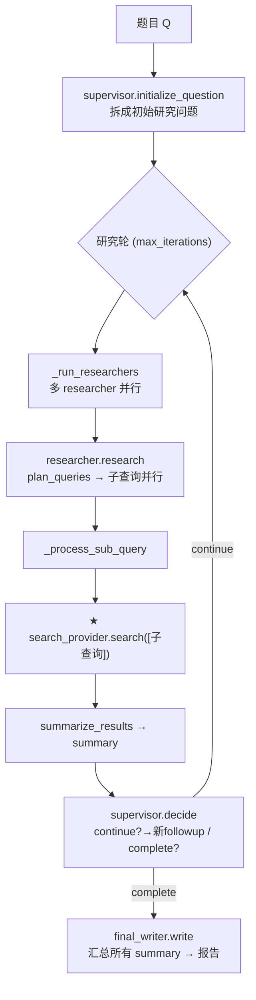

# 一道题的完整 research 全过程(含 search 查/抓/存/取 + online/local)

> 以例题 **"What are the main methods for recycling lithium-ion batteries?"** 走一遍 deep_researcher_demo
> 的研究全流程,重点讲 search 的**查、抓、存、取**和 **online/local** 两模式。代码引用为相对本文件
> (`claude-docx/`)的可点击链接。真实产物见 `eval/results/search_cache/e6/q1/`。

---

## 〇、一句话总览
**supervisor 拆问题 → 多个 researcher 并行(每个再拆子查询并行)→ 每个子查询走 search 拿相关内容 → 压成 summary → supervisor 决定继续/结束 → writer 汇总成报告。** search 这一步在不同模式下"查/抓/存/取"走法不同。



---

## 一、启动:构建 provider 栈(cli.py)
[deep_researcher_demo/cli.py](../deep_researcher_demo/cli.py#L65-L97):
1. [cli.py:69](../deep_researcher_demo/cli.py#L69) `create_search_provider("duckduckgo", fetcher="crawl4ai")` → 最内层 `DuckDuckGoSearchProvider`。
2. [cli.py:86](../deep_researcher_demo/cli.py#L86) `wrap_with_cache(mode=record/replay, benchmark, sample_id, relevance=cache_relevance)` → 包 `CachingSearchProvider`。**online/local 时 `relevance=True`**(块级 embedding 检索在这层做)。
3. [cli.py:96](../deep_researcher_demo/cli.py#L96) `wrap_with_relevance(enabled=relevance_enabled)` → online/local 下 `relevance_enabled=False`,**这层是 no-op**(top-k 已在 cache 层);只给老 `SEARCH_CACHE` 直连路径用。

> 模式:`RESEARCH_MODE=online`→ record + cache_relevance;`=local`→ replay + cache_relevance([config.py `_resolve_cache_mode`/`_resolve_cache_relevance`](../deep_researcher_demo/config.py))。
> 所以 online/local 的 provider 栈实际是 **2 层**:`CachingSearchProvider(relevance=True)` 套 `DuckDuckGoSearchProvider`。

## 二、研究主循环(workflow.py)
[DeepResearchWorkflow.run](../deep_researcher_demo/workflow.py#L54):
1. [workflow.py:76](../deep_researcher_demo/workflow.py#L76) `supervisor.initialize_question(Q)` → LLM 拆出初始研究问题(harvest tag `INITIAL_RESEARCH_QUESTIONS_JSON`)。
2. 循环 [workflow.py:98](../deep_researcher_demo/workflow.py#L98):每轮
   - [workflow.py:110](../deep_researcher_demo/workflow.py#L110) `_run_researchers(current_questions)` → [workflow.py:211](../deep_researcher_demo/workflow.py#L211) `asyncio.gather` **多 researcher 并行**(`max_concurrency` 信号量)。
   - [workflow.py:118](../deep_researcher_demo/workflow.py#L118) `supervisor.decide(summaries)` → LLM 出 continue+followups / complete(tag `SUPERVISOR_DECISION_JSON`)。
   - continue → 新 followup 进下一轮;complete → 跳出。
3. [workflow.py:174](../deep_researcher_demo/workflow.py#L174) `final_writer.write(summaries, summary_sources)` → LLM 汇总成报告(tag `FINAL_REPORT_MARKDOWN`;detailed_cited 模式带 inline 引用)。

## 三、单个 researcher(agents.py)
[Researcher.research](../deep_researcher_demo/agents.py#L431):
1. [agents.py:440](../deep_researcher_demo/agents.py#L440) `plan_queries(question)` → LLM 列子查询(tag `QUERY_PLAN_JSON`)。
2. [agents.py:457](../deep_researcher_demo/agents.py#L457) `asyncio.gather` **多子查询并行** `_process_sub_query`。
3. [_process_sub_query:382](../deep_researcher_demo/agents.py#L382):
   - [agents.py:398](../deep_researcher_demo/agents.py#L398) **`search_provider.search([query])`** ← **search 真正入口**(每子查询一次)。
   - [agents.py:412](../deep_researcher_demo/agents.py#L412) `summarize_results(...)` → LLM 把 search 拿回的相关内容压成 summary(tag `RESEARCH_SUMMARY_TEXT`)。

---

## 四、★ search 的查/抓/存/取(`search([query])` 内部)
provider 栈 2 层:`CachingSearchProvider` → `DuckDuckGoSearchProvider`。四个动作落在不同层:

| 动作 | 谁干 | 代码 | 仅 online? |
|---|---|---|---|
| **查** 搜 URL | DuckDuckGo(`ddgs.text`)| [search.py `_search_one`:75](../deep_researcher_demo/search.py#L75) | 是 |
| **抓** 取正文 | crawl4ai 无头浏览器 → Markdown | [`_fetch_with_crawl4ai`:129](../deep_researcher_demo/search.py#L129) → [scrape_crawl4ai.fetch_pages](../deep_researcher_demo/scrape_crawl4ai.py#L30) | 是 |
| **存** 落盘 | 页+索引+块向量 | [`_record_query`:481](../deep_researcher_demo/search.py#L481) + [`_append_chunk_index`:546](../deep_researcher_demo/search.py#L546) | 是 |
| **取** 选相关 | embedding 全局 top-k | online:[`_embed_select_for_query`:584](../deep_researcher_demo/search.py#L584) / local:[`_search_replay_embed`:599](../deep_researcher_demo/search.py#L599) | 两模式都做 |

**存** 的产物(`eval/results/search_cache/<benchmark>/q<index>/`):
- `pages/<hash>.txt` 整页正文、`pages_index.json` url→file、`search_cache.json` query→url(provenance)。
- **`chunks.jsonl`** 每行 `{url,ci,text,emb(1024)}` —— **块向量只在存页这刻算一次**([`_append_chunk_index`](../deep_researcher_demo/search.py#L546)),online 的"取"和所有 local 的"取"都复用它,不重算。

---

## 五、online 模式:查→抓→存→取(联网)
`RESEARCH_MODE=online`(record + relevance),[CachingSearchProvider.search 的 record 分支](../deep_researcher_demo/search.py#L383):
```
search([query])
└─ CachingSearchProvider.search (record)               日志 SEARCH_PATH=LIVE(record+embed)
   ├─ base.search([query])  →  DuckDuckGoSearchProvider
   │     ├─ _search_one: ddgs.text(query)        【查】→ URL + snippet
   │     └─ _fetch_with_crawl4ai                 【抓】→ crawl4ai 渲染取正文 raw_content
   ├─ _record_query(query, results)              【存1】pages/ + pages_index + search_cache;返回新页
   ├─ _append_chunk_index(新页)                  【存2】切块(~1000tok)+embed → chunks.jsonl(url幂等)
   └─ _embed_select_for_query(query, 本查询urls) 【取】embed query → select_topk(块向量) → 按url拼回
```
- 例题 e6/q1 实跑:存了 21 页 / `chunks.jsonl` 50 块;每子查询返回相关块拼回的 per-url 结果。
- "存" 的块向量当场就被 "取" 复用(只 embed query,不重算块)。

## 六、local 模式:只取(纯离线语义检索)
`RESEARCH_MODE=local`(replay + relevance),[`_search_replay_embed`](../deep_researcher_demo/search.py#L599):
```
search([query])
└─ CachingSearchProvider._search_replay_embed          日志 SEARCH_PATH=CACHE(embed)
   ├─ _ensure_chunk_index: 缺 chunks.jsonl → 从 pages 切块+embed 懒构建(老缓存自动升级)
   ├─ 载入 chunks.jsonl(全题页池的块向量)
   └─ 对每个子查询: embed query → select_topk(全题块向量) → 按 url 拼回
```
- **不查、不抓、不存**:零联网、不调 crawl4ai、块向量不重算(只 embed query)。
- **语义检索、与原查询解耦**:措辞不同但同义的子查询也能检到相关页(不像旧 query→url 精确匹配会 cold-miss)。
- 全题块向量在**一个池**里竞争全局 top-k(不是每页各取)。

## 七、两模式差异
| | online(record)| local(replay)|
|---|---|---|
| 查 DDG / 抓 crawl4ai | ✅ | ❌ |
| 存 pages + chunks.jsonl | ✅(新页)| ❌(只读)|
| 取(embedding 全局 top-k)| ✅ 用刚存的块向量 | ✅ 用已存块向量 |
| 块向量 embed | **算一次(存页时)** | 不算(读)|
| 联网 | 是 | **否(纯离线)** |
| 日志 | `LIVE(record+embed)` | `CACHE(embed)` |

**一句话**:online 把"查+抓+存+取"全做,块向量只算一次落 `chunks.jsonl`;local 只做"取"——读那份块向量做语义检索,与"原查询抓了哪些 url"彻底解耦。两模式喂给 summary 的都是 embedding 选出的相关块。

## 相关文档
- 模式/env/缓存结构:[research-modes-and-search.md](research-modes-and-search.md)
- search 构建与调用链(2 层栈细节):[search-call-chain.md](search-call-chain.md)
- crawl4ai 安装/运行时:[crawl4ai-setup.md](crawl4ai-setup.md)
