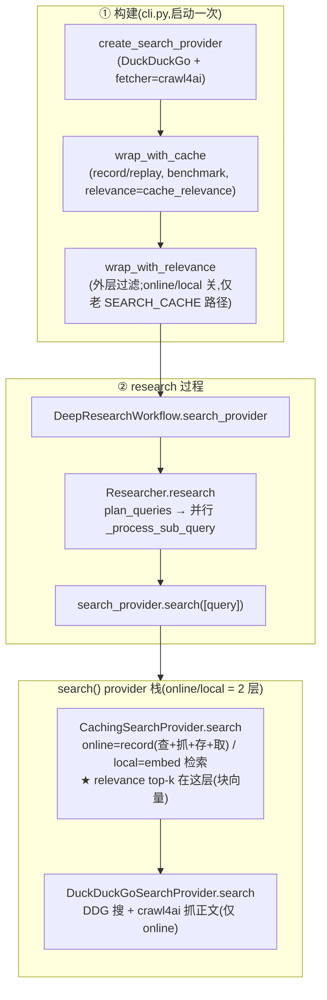

# research 里 search 的入口与调用链(online / local 两模式)

> 讲清:search 在哪构建、research 过程中怎么被调、online 和 local 分别怎么走。代码引用为
> 相对本文件(`claude-docx/`)的可点击链接。

---

## 一、两个阶段
search 分两段:**① 启动时构建 provider 栈**(cli),**② research 过程中被 researcher 调用**。



---

## 二、构建阶段(cli.py;online/local 实际是 2 层)
[deep_researcher_demo/cli.py](../deep_researcher_demo/cli.py#L69-L96):
1. [cli.py:69](../deep_researcher_demo/cli.py#L69) `create_search_provider(config.search_provider, fetcher=config.search_fetcher)` → 最内层 `DuckDuckGoSearchProvider`(默认 fetcher=crawl4ai)。
2. [cli.py:86](../deep_researcher_demo/cli.py#L86) `wrap_with_cache(..., mode=record/replay, benchmark, sample_id, relevance=config.cache_relevance)` → 包 `CachingSearchProvider`。**online/local 时 `relevance=True`,块级 embedding 检索 + relevance top-k 都在这层。**
3. [cli.py:96](../deep_researcher_demo/cli.py#L96) `wrap_with_relevance(..., enabled=config.relevance_enabled)` → 外层 `RelevanceFilteringProvider`。**online/local 下 `relevance_enabled=False`,这层 no-op**(top-k 已在 cache 层);只给老 `SEARCH_CACHE` 直连/off 路径用。
4. [cli.py:111](../deep_researcher_demo/cli.py#L111) 传给 `DeepResearchWorkflow`。

> 模式由 `RESEARCH_MODE` 经 [config.py](../deep_researcher_demo/config.py) 的 `_resolve_cache_mode`(online→record/local→replay)+ `_resolve_cache_relevance`(online/local→True)映射。
> 所以 online/local 的栈是 **2 层**:`CachingSearchProvider(relevance=True)` 套 `DuckDuckGoSearchProvider`。

## 三、research 过程中怎么被调
[workflow.py:225](../deep_researcher_demo/workflow.py#L225) 把 `self.search_provider` 传给 `Researcher.research`:
- [agents.py `Researcher.research`:431](../deep_researcher_demo/agents.py#L431):先 `plan_queries`(LLM 列子查询),再 [agents.py:456](../deep_researcher_demo/agents.py#L456) `asyncio.gather` **并行**对每个子查询跑 `_process_sub_query`。
- [agents.py `_process_sub_query`:382](../deep_researcher_demo/agents.py#L382):核心一行 [agents.py:398](../deep_researcher_demo/agents.py#L398) `results = await search_provider.search([query], max_results=max_results)`,拿到结果后 [agents.py:412](../deep_researcher_demo/agents.py#L412) `summarize_results` 压成 summary。

→ **search 的真正入口 = `search_provider.search([query])`**(每个子查询一次,多 researcher × 多子查询并行)。

## 四、search() 栈(online/local = 2 层;relevance 在 cache 层)
每次 `search([query])` 顺着栈走:

1. **CachingSearchProvider.search** [search.py:378](../deep_researcher_demo/search.py#L378):按 mode 分叉——
   - online(record):经 base 查+抓 → 存(pages + chunks.jsonl)→ 取(块向量 top-k),见五。
   - local(replay):[_search_replay_embed:599](../deep_researcher_demo/search.py#L599) 直接 embedding 检索,见六。
   - **relevance 的块级 top-k 就在这层做**(online [_embed_select_for_query:584](../deep_researcher_demo/search.py#L584) / local [_search_replay_embed:599](../deep_researcher_demo/search.py#L599),都调 [relevance.select_topk:96](../deep_researcher_demo/relevance.py#L96)),**不再走外层**。
2. **DuckDuckGoSearchProvider.search** [search.py:56](../deep_researcher_demo/search.py#L56)(**仅 online 调**):DDG `ddgs.text` 搜 → [_fetch_with_crawl4ai:129](../deep_researcher_demo/search.py#L129) → [scrape_crawl4ai.fetch_pages:30](../deep_researcher_demo/scrape_crawl4ai.py#L30) 用无头 Chromium 抓正文回填 `raw_content`。

> 外层 `RelevanceFilteringProvider` 对 online/local 是 no-op;只有老 `SEARCH_CACHE` 直连/off 路径才用它的 [relevance.filter_results:117](../deep_researcher_demo/relevance.py#L117)。

---

## 五、online 模式具体怎么走(RESEARCH_MODE=online → record + relevance)
查→抓→存→取(都在 cache 层):

```
search([query])
└─ CachingSearchProvider.search  (record 分支, search.py:378)   日志 LIVE(record+embed)
   ├─ base.search([query]) → DuckDuckGoSearchProvider
   │     ├─ _search_one: ddgs.text(query)        【查】→ URL
   │     └─ _fetch_with_crawl4ai → crawl4ai      【抓】→ 整页正文 raw_content
   ├─ _record_query(search.py:481)               【存1】pages/ + pages_index + search_cache;返回新页
   ├─ _append_chunk_index(search.py:546)          【存2】新页切块(~1000tok)+embed → chunks.jsonl(url幂等)
   └─ _embed_select_for_query(search.py:584)      【取】embed query → select_topk(块向量) → 按 url 拼回
```
- **块向量只在这刻算一次**(`chunks.jsonl`),online 的"取"和以后 local 的"取"都复用它。
- 落盘按 `SEARCH_BENCHMARK`+`SEARCH_CACHE_SAMPLE_ID` 分类:`<root>/<benchmark>/q<index>/`([search.py:362](../deep_researcher_demo/search.py#L362))。
- 日志:`SEARCH_PATH=LIVE(record+embed) q<index>`。

## 六、local 模式具体怎么走(RESEARCH_MODE=local → cache=replay + relevance)
纯离线**embedding 语义检索**(已不靠 query→url 精确匹配):

```
search([query])
└─ CachingSearchProvider._search_replay_embed  (search.py)
      │  _ensure_chunk_index:缺 chunks.jsonl → 从 pages 切块+embed 懒构建(老缓存自动升级)
      │  载入该题 chunks.jsonl(全题页池的块向量)
      │  embed 子查询 → select_topk:cosine 取全局 top-k(≥阈值)→ 按 url 拼回
      │  零联网、不调 crawl4ai、块向量不重算(只 embed query)
      │  打 SEARCH_PATH=CACHE(embed) q<index> | 池块=.. 命中块=..
```
- 检索 = 语义相似,与"原查询抓了哪些 url"**解耦**:措辞不同但同义的子查询也能检到相关页(不再 cold-miss)。
- 块级 embedding 即相关性 top-k,**不再叠加外层 `RelevanceFilteringProvider`**(cache 层已做)。
- `search_cache.json`(query→url)仍在,但 local **不依赖**它(provenance);chunks.jsonl 缺失才回退老 query→url replay。
- crawl4ai **不参与**(正文是 online 抓好存的)。

---

## 七、两模式差异一览
| | online (record) | local (embed replay) |
|---|---|---|
| 联网搜索(DDG)| ✅ | ❌ |
| crawl4ai 抓正文 | ✅ | ❌(读已存页)|
| 存 pages + chunks.jsonl | ✅(新页)| ❌(只读;缺索引才懒构建)|
| 块向量 embed | **算一次(存页时)** | 不算(读 chunks.jsonl)|
| **取 = embedding 全局 top-k(cache 层)** | ✅ 用刚存的块向量 | ✅ 用已存块向量 |
| 日志 | `SEARCH_PATH=LIVE(record+embed)` | `SEARCH_PATH=CACHE(embed)` |

**一句话**:两模式都在 cache 层做 embedding 块级 top-k(同一套 `select_topk`);只差正文从哪来——online 现搜现抓、顺带把块向量存进 `chunks.jsonl`;local 纯读那份块向量做语义检索(与原查询解耦)。
