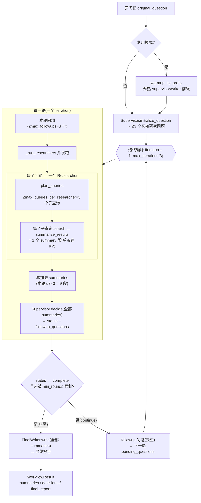

# Deep Research Agent 工作流说明

> 本文描述 [deep_researcher_demo](../deep_researcher_demo/workflow.py) 这个简化版 deep research agent 的完整工作流,
> 重点讲清**每轮产出多少个 summary**(这是最容易误判的地方)以及 KV 复用视角下的"段"概念。
> 所有数字均来自代码默认值 + 实测 harvest,可复核。

---

## 一、一句话概览

给一个研究问题,agent **多轮迭代**地:把问题拆成子查询 → 搜索 → 压缩成 summary → 由 supervisor 看着已有
summary **决定继续追问还是收尾** → 最后由 writer 把所有 summary 汇成报告。整个过程是**纯 Python 的普通
async 循环**,不用 LangChain/LangGraph。

代码主入口:[`ResearchWorkflow.run()`](../deep_researcher_demo/workflow.py)(主循环);
角色实现在 [`agents.py`](../deep_researcher_demo/agents.py)。

---

## 二、四个角色(agent)

| 角色 | 干什么 | 关键方法 |
|---|---|---|
| **Supervisor**(主管) | 每轮看着全部已有 summary,决定 `continue`(并提 followup 问题)还是 `complete`;开局还负责把原问题拆成初始研究问题 | `initialize_question` / `decide` |
| **Researcher**(研究员) | 拿到**一个**研究问题,先做 query plan(拆成多个搜索子查询),并发搜+逐个压缩,再把子 summary 拼成一条返回 | `research` / `plan_queries` |
| **Summarizer**(压缩器) | 把**一个子查询**的搜索结果压成一段 plain-text summary —— **这就是可复用的最小 KV 段** | `summarize_results` |
| **FinalWriter**(终稿) | 把累计的所有 summary 写成最终报告 | `write` |

> 默认四个角色用**同一个模型**(`MODEL`,本实验 = Qwen3-32B);可分别用 `SUPERVISOR_MODEL` 等覆盖。

---

## 三、三层扇出 —— 决定 summary 数量的关键

每题的 summary 数量是**三个旋钮连乘**出来的,不是单一数字。这是"为什么不是 9 个"的根源:

| 层 | 配置项(默认) | 含义 |
|---|---|---|
| ① 轮数 | `max_iterations = 3` | 每题最多迭代几轮 |
| ② 每轮问题数 | `max_followups = 3` | supervisor 每轮最多提几个 followup 研究**问题**(= 几个 researcher) |
| ③ 每问题子查询数 | `max_queries_per_researcher = 3` | 每个 researcher 把一个问题拆成最多几个搜索**子查询** |
| —— | 每个子查询 | → **产 1 个 summary 段** |

其它相关旋钮:`max_concurrency=3`(researcher 并发上限)、`max_results=5`(每个子查询取几条搜索结果)、
`min_rounds=0`(Exp A 用来强制至少跑几轮,默认关)、`kv_reuse_separator`(复用模式的段分隔符,如 `<|fim_pad|>`)。

### 每轮产多少 summary?

```
每轮 summary 数 = (该轮问题数 ≤3) × (每问题子查询数 ≤3) = 最多 9 个
```

- **第 1 轮**:问题来自 `initialize_question` 拆出的初始问题(≤ `max_followups` = 3 个),每个再拆 ≤3 子查询 → **≤9 个 summary**。
- **第 2/3 轮**:问题来自上一轮 supervisor 提的 followup(≤3 个),同样 ×3 子查询 → 每轮 **≤9 个**。

### 每题总共多少 summary?

```
每题总 summary ≤ max_iterations × max_followups × max_queries_per_researcher = 3 × 3 × 3 = 27
```

实测(当前默认配置,无强制多轮):

- **q1**:第1轮 9 + 第2轮 9 + 第3轮 3 = **21 个 summary,3 个决策**。
- Exp A 那次 58 题:每题最后决策点累计 summary **平均 ~17 个**(9~27 不等,取决于实际跑了几轮、query plan 实际给了几个子查询、是否提前收尾)。

> ⚠️ **常见误判**:把"每轮 3 个 sub-researcher"当成"每轮 3 个 summary"。实际上"3"是**问题数**,每个问题
> 又扇出 ~3 个子查询、各产 1 个 summary,所以每轮是 **~9 个 summary**,每题 ~17~21 个,不是 9 个。

---

## 四、主循环逐步(对照 [`workflow.py`](../deep_researcher_demo/workflow.py))

1. **(仅复用模式)warmup**:`warmup_kv_prefix` 预热 supervisor / writer 的固定前缀,让 blend 查找能从 token 0 连续命中到 summary 段。
2. **开局**:`initialize_question(原问题)` → 拆出 ≤3 个初始研究问题。
3. **进入迭代循环**(`for iteration in 1..max_iterations`):
   - a. `_run_researchers(本轮问题)`:把本轮 ≤3 个问题**并发**交给 researcher。每个 researcher 内部 `plan_queries`(≤3 子查询)→ 并发搜索 + 逐子查询 `summarize_results`(每个**单独存成一个 KV 段**)→ 用分隔符拼成一条返回。
   - b. 把本轮所有 summary 累加进总 `summaries`。
   - c. `supervisor.decide(原问题, 全部 summaries)` → 输出 `{status, followup_questions, reason}`。
   - d. 若 `status == complete` 且未被 `min_rounds` 强制 → **break**(收尾)。
   - e. 否则把 followup 问题(去重)作为下一轮的 `pending_questions`。
4. **终稿**:`final_writer.write(原问题, 全部 summaries)` → 最终报告。
5. 返回 `WorkflowResult`(含 summaries / supervisor_reasons / final_report 等)。

---

## 五、KV 复用视角:"段"= 一个子查询 summary

复用模式(`kv_reuse_separator` 非空,如 `<|fim_pad|>`)下:

- 每个子查询的 summary 在**生成时**就把它 decode 出来的 KV 存进 LMCache(`store_generated_kv=True`,tag `RESEARCH_SUMMARY_TEXT`)。
- researcher 把同一问题的多个子 summary **用分隔符拼接**:`SEP s1 SEP s2 SEP s3`(见 [`research()`](../deep_researcher_demo/agents.py));supervisor/writer 在外层再加分隔符。
- 所以下游(supervisor 决策、最终报告)的 prompt 里,summary 是**一段一段被分隔符隔开**的,每段 = **一个子查询 summary** = **一次可复用的 KV 单元**。

这直接决定了 Exp A 的实验单位:**一个"段-swap 事件" = 把其中一个子查询 summary 段的 KV 换成复用值**(其余保持真值),看 supervisor 决策怎么变。所以 58 题 × 每题 ~17 段 ≈ **1006 个事件**,和上面的三层扇出完全吻合 —— 不是 bug,也不需要强制多轮。

---

## 六、流程图(Mermaid)



---

## 七、和当前实验的关系(避免混淆)

| | Exp A(单段诊断 · 探针) | 当前全段实验(主线) |
|---|---|---|
| demo 配置 | 同样 3×3×3,每题 ~17~21 段 | 同样 3×3×3,每题 ~21 段 |
| 实验单位 | **段-swap 事件**:最后决策点逐段 swap(1 段→1 reuse、其余真值)→ 每段 \|Δz\| | **题**:整个 agent 跑两遍(prefill 全真值 vs reuse 全程复用所有段)→ 比整条轨迹 |
| 规模 | 58 题 × ~17 段 = 1006 事件 | 40 题 × 2 轨 |
| 复用范围 | 一次只动 1 段 | 一次动**全部** ~21 段(放任累积) |

> 逐段 \|Δz\| 那种"1006 式"的事件,在当前全段实验里只会出现在后续**解法验证的探针轨**,主线不按段计数。

---

*配置默认值见 [`config.py`](../deep_researcher_demo/config.py);主循环见 [`workflow.py`](../deep_researcher_demo/workflow.py);角色见 [`agents.py`](../deep_researcher_demo/agents.py)。*
