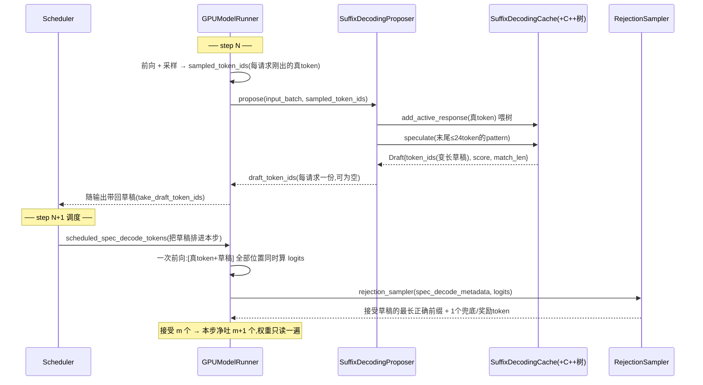

# vLLM suffix 投机解码:手把手看一个草稿的一生(参数先行 + 按调用顺序,大白话)

> 缘起:deep_researcher_demo 的 RESEARCH_SUMMARY / FINAL_REPORT 生成大量**逐字照搬输入 prompt**。这种"输出抄输入"的场景,**suffix 投机解码**能把被抄的整段一次性猜出+验证通过,提升 decode 吞吐。
> **读法**:它底层那棵后缀树(是什么、怎么建、怎么查、怎么打分)已经在零基础教程 [19-suffix-tree-explained.md](19-suffix-tree-explained.md) 里手把手讲完——本文不重复,遇到树的细节一律给 19 号的传送门。本文讲的是**这棵树怎么被装进 vLLM 的生成循环**:谁在什么时候建树、草稿怎么被排进下一步、验证怎么保证无损、6 个参数各拧在哪个环节。每个环节都是**先人话、再钉源码行号**,括号里的源码坐标不影响理解、可跳过。实测结论见 [summary.md](suffix-spec-decode/docs/summary.md)。
> 论文:Suffix Decoding(arXiv 2411.04975,Snowflake Arctic Inference)。vLLM 0.18 内置 `method="suffix"`。涉及的 4 层源码(lmcache env):
> - vLLM 层:[suffix_decoding.py](../../anaconda3/envs/lmcache/lib/python3.12/site-packages/vllm/v1/spec_decode/suffix_decoding.py)(SuffixDecodingProposer,~100 行)
> - 包装层:[cache.py](../../anaconda3/envs/lmcache/lib/python3.12/site-packages/arctic_inference/suffix_decoding/cache.py)(SuffixDecodingCache)
> - C++ 层:[suffix_tree.h](../../anaconda3/envs/lmcache/lib/python3.12/site-packages/arctic_inference/csrc/suffix_decoding/suffix_tree.h) / [suffix_tree.cc](../../anaconda3/envs/lmcache/lib/python3.12/site-packages/arctic_inference/csrc/suffix_decoding/suffix_tree.cc)(SuffixTree/Draft,nanobind 绑定为 `_C`)
> - 集成层:[gpu_model_runner.py](../../anaconda3/envs/lmcache/lib/python3.12/site-packages/vllm/v1/worker/gpu_model_runner.py) + [scheduler.py](../../anaconda3/envs/lmcache/lib/python3.12/site-packages/vllm/v1/core/sched/scheduler.py) + [rejection_sampler.py](../../anaconda3/envs/lmcache/lib/python3.12/site-packages/vllm/v1/sample/rejection_sampler.py)

---

## TL;DR

普通 decode 一步只出 1 个 token,而这一步的成本大头是**把整个模型权重从显存整读一遍**——像印刷机开一次机却只印一个字。投机解码 = **先猜一串草稿,开一次机把整串一起验证**:猜对的前缀全收,一次读权重吐出多个 token。
suffix 的特别之处:**猜题人不是小神经网络,是一棵背熟了 prompt 的后缀树**——19 号教程的主角,一个"只会背 prompt 的 n-gram 小语言模型",纯查表、不占 GPU。"抄输入/抄历史"的地方它猜得又长又准。
**无损**:草稿收不收,只看目标模型自己的答案(§三-7),输出和不开投机逐 token 一致。赌输赌赢只影响速度。

---

## 一、参数速查:6 个旋钮(每个的原理都在 19 号手把手讲过)

打底比喻:suffix = 打字时的**整句联想**。**赢 = 一个被接受的草稿 token = 省一步 decode(整读一遍 32B 权重);输 = 草稿被拒 = 白搭验证。** 所有参数都在调"赌注下多大、多有把握才下注":

| 参数(默认) | 大白话:调的是什么 | 原理(19 号)/ 生效环节(本文) | 实测(60 条 summary) |
|---|---|---|---|
| [`suffix_decoding_max_tree_depth`=24](../../anaconda3/envs/lmcache/lib/python3.12/site-packages/vllm/config/speculative.py#L151) | **窗口多长**:树记多深、匹配时往回看多长,一个数同时封顶 | 限深 = 19 §二-4 / 建树 §三-2、取 pattern §三-4 | 未扫(唯一没试的杠杆;调小可能降固定税,见优化方案 L4) |
| [`num_speculative_tokens`(None→自动=24)](../../anaconda3/envs/lmcache/lib/python3.12/site-packages/vllm/config/speculative.py#L612-L618) | **单步草稿硬上限**(保险丝)。**只数草稿本身、不含已命中的 match_len**;"命中+草稿 ≤ 24"的和约束是树深(max_tree_depth)给的,不是它。默认=树深,而草稿结构上 ≤ 树深−match_len,**这根保险丝默认永远绷不紧**——实际卡草稿的是 预算 m×factor / 树深余量 / 置信度 三道闸取最小 | 猜草稿 §三-4 | 默认即可 |
| [`suffix_decoding_max_spec_factor`=1.0](../../anaconda3/envs/lmcache/lib/python3.12/site-packages/vllm/config/speculative.py#L161) | **胆量∝证据**:结尾匹配上 N 个 token,才敢猜 factor×N 个 | 预算 = 19 §四 / C++ 预算公式 §三-4 | 0.5(胆小一半)→ **0.838x 全场最差**:赢的总额被砍,税一分没少 |
| [`suffix_decoding_min_token_prob`=0.1](../../anaconda3/envs/lmcache/lib/python3.12/site-packages/vllm/config/speculative.py#L166) | **连乘置信度的收手线**:"这份草稿到这一位还全对的概率 ≥10%,才继续往下写" | 连乘 = 19 §四追问三 / 贪心走廊 §三-4 | 0.05→0.889x(乱猜浪费验证)、0.3→0.922x、0.5→0.917x;**默认 0.1 就是最优(0.955x)** |
| [`suffix_decoding_max_cached_requests`=10000](../../anaconda3/envs/lmcache/lib/python3.12/site-packages/vllm/config/speculative.py#L155) | **全局树背多少条历史请求的输出**(0 = 彻底关掉全局树) | 全局树 = 19 §五 / 槽位 §三-2、查树 §三-4、驱逐 §三-5 | =0 → 0.872x(summary 略差;report 1.76x 几乎不掉);**热树陷阱**:背过题的 server 重测假显 1.9x |
| (`max_spec_offset`=0.0 / `use_tree_spec`=False) | 预算公式加项 / 树状多分支草稿(平手时"两个都猜"的机制,见 19 §四追问二)。**vLLM 0.18 没暴露**,恒 0 / 恒单路径 | §三-4 | — |

**一张图把参数串起来**(一次猜测内部,细节见 §三-4):

```
pattern(末尾≤24个token,由 max_tree_depth 决定)
   │  枚举 match_len = 1..24,_match_context 找匹配点
   ▼
每个匹配点:预算 = min(num_speculative_tokens(24), match_len × max_spec_factor(1.0))
   │  _speculate_path 沿最高频孩子往下走
   ▼
走到分叉:prob ×= 频占比;prob < min_token_prob(0.1) → 停
   │
   ▼
本地树、全局树(容量 max_cached_requests=10000)各出一份 → score 高者当草稿
```

三条全局注记(常见疑问):
- **以上就是全部可调参数**(grep 全库核实),且都是 **server 级、启动时定死**——vLLM 0.18 没有按请求开关投机的能力;async scheduling 的禁用也发生在启动时的配置校验([vllm.py:719-731](../../anaconda3/envs/lmcache/lib/python3.12/site-packages/vllm/config/vllm.py#L719-L731))。
- **"生成的 token 是否入树"只有半个开关**:全局树可关(`max_cached_requests=0`);本请求的**本地树没有开关**,proposer 无条件把新 token 追加进去(§三-3)。想消融"抄自己前文"只能改代码。
- **接受率 ≠ 加速**:省时间靠"接受的 token 总数",不靠命中比例(实测 cache=0 接受率 50% 却只有 0.872x)。详见 [questions-log.md](suffix-spec-decode/docs/questions-log.md) Q8。

---

## 二、全景:一个草稿的一生(先认人,再看图)

登场的五个角色,先用人话介绍:

- **Scheduler(调度员)**:每一步决定哪些请求上车、每个请求这步带几个 token;
- **GPUModelRunner(车间主任)**:张罗每一次前向——备输入、跑模型、采样出真 token;
- **SuffixDecodingProposer(猜题人)**:纯 CPU 的挂件,手里管着 19 号讲的那些树;
- **SuffixDecodingCache + C++ 树(题库)**:本地树每请求一棵、全局树整个引擎一棵(布局见 19 §五);
- **RejectionSampler(批改老师)**:拿草稿和模型自己的答案逐位置比对,决定收几个。

节奏只有一句:**第 N 步猜,第 N+1 步验**——一个草稿的一生横跨两个相邻的 decode step:



---

## 三、按时间线手把手(每环节先人话,源码钉子在后)

### 三-0)开机:雇好猜题人,顺手交出"进场费"

**人话**:server 启动时,vLLM 发现配置里写了 `method="suffix"`,就雇一个猜题人:读进 §一那 6 个参数、造一个**空**题库。猜题人不加载任何模型权重——它只会查表。
但雇它有一笔隐性代价:**async scheduling(异步调度)被关掉**。异步调度是什么:CPU 为**下一步**做的排班/构建输入张量,本来可以和 GPU 算**当前步**重叠起来(像后厨边炒这道菜边备下一道的料),每步墙钟 ≈ GPU 时间。它的前提是"不看本步结果就能排好下一步"——普通 decode 每请求每步恒 +1 token,可预测;suffix 下每请求本步净吐 1~25 个不等(验证完才知道),且下一步要带的草稿是 CPU 在本步采样后才算出来的 → 下一步的车票内容依赖本步的完整结果,只能串行。代价:CPU 段从"藏在 GPU 后面"变成"串在 GPU 前面",对 32B TP4 一步 ~30ms 的 decode 多出几毫秒——**这笔"进场费"每步都收、与命中无关**(连同每步查树,实测 ≈18%,见 §五)。

**源码钉子**:[gpu_model_runner.py:544](../../anaconda3/envs/lmcache/lib/python3.12/site-packages/vllm/v1/worker/gpu_model_runner.py#L544) 建 `SuffixDecodingProposer`,[:565](../../anaconda3/envs/lmcache/lib/python3.12/site-packages/vllm/v1/worker/gpu_model_runner.py#L565) 建 `RejectionSampler`;[`__init__`(suffix_decoding.py:16-33)](../../anaconda3/envs/lmcache/lib/python3.12/site-packages/vllm/v1/spec_decode/suffix_decoding.py#L16-L33) 读参数、建空 `SuffixDecodingCache`,[`load_model` 是空的(:99-101)](../../anaconda3/envs/lmcache/lib/python3.12/site-packages/vllm/v1/spec_decode/suffix_decoding.py#L99-L101);关异步调度的 warning 在 [vllm.py:719-731](../../anaconda3/envs/lmcache/lib/python3.12/site-packages/vllm/config/vllm.py#L719-L731)。

### 三-1)每个 decode step 的入口:采样完,轮到猜题人(纯 CPU)

**人话**:车间主任跑完前向、采样出真 token 后,把 batch 里所有请求交给猜题人过一遍。有两类请求直接跳过(给空草稿):还没吐出过 token 的(chunked prefill 中途),和已经到长度上限的。其余每个请求依次经历 §三-2 → §三-4。

**源码钉子**:入口 [:3933(包装)](../../anaconda3/envs/lmcache/lib/python3.12/site-packages/vllm/v1/worker/gpu_model_runner.py#L3933) → [:4287-4292(suffix 分支)](../../anaconda3/envs/lmcache/lib/python3.12/site-packages/vllm/v1/worker/gpu_model_runner.py#L4287-L4292) 调 [`propose`(suffix_decoding.py:35-97)](../../anaconda3/envs/lmcache/lib/python3.12/site-packages/vllm/v1/spec_decode/suffix_decoding.py#L35-L97);跳过条件 [:50-53](../../anaconda3/envs/lmcache/lib/python3.12/site-packages/vllm/v1/spec_decode/suffix_decoding.py#L50-L53)、[:56-60](../../anaconda3/envs/lmcache/lib/python3.12/site-packages/vllm/v1/spec_decode/suffix_decoding.py#L56-L60)。

### 三-2)新请求第一次露面:用整个 prompt 建本地树 ⚙️

**人话**:猜题人第一次见到某个请求,给它**新建一棵本地树**,把整个 prompt 喂进去。怎么喂——滑动指针队列、每个起点 ≤⚙️`max_tree_depth`(24) 的窗口、count(=子串出现次数)建树时白送——**19 §三用 7 个 token 逐步演过全程**,此处不重复。若全局缓存开着(⚙️`max_cached_requests≠0`),再给它在全局树里分配一个 `seq_id` 槽位:这个槽位将来装的是它的**输出**(prompt 不进全局树),槽位满了就 FIFO 驱逐最老的请求。
19 号的人话概念 ↔ 源码字段,一张表对上:

| 19 号里的说法 | 源码里的名字 |
|---|---|
| 节点的次数(= 它代表的子串的出现次数) | [`Node.count`(suffix_tree.h:29)](../../anaconda3/envs/lmcache/lib/python3.12/site-packages/arctic_inference/csrc/suffix_decoding/suffix_tree.h#L29-L60) |
| 断点书签队列(滑动指针,19 §三) | [`_active_nodes`(suffix_tree.h:164-168)](../../anaconda3/envs/lmcache/lib/python3.12/site-packages/arctic_inference/csrc/suffix_decoding/suffix_tree.h#L164-L168),`std::deque<Node*>` |
| 按票数排好队的孩子(投票 O(1) 拿队首) | `children` 按 count 降序 + `head_child`(`Group` 双向链表,count 一变实时重排) |
| 删除用的账本(哪些序列的窗口在此结束) | `endpoints` |
| 路径压缩(独苗链合并、只存引用不拷贝) | `token`/`length`/`ref_seq`/`ref_idx` |
| 一份草稿(token 串+各自置信度+期望收益+匹配长) | [`Draft{token_ids, probs, score, match_len}`(suffix_tree.h:102)](../../anaconda3/envs/lmcache/lib/python3.12/site-packages/arctic_inference/csrc/suffix_decoding/suffix_tree.h#L102-L117) |

**布局**(19 §五讲过):本地树每请求一棵、里面只有一条序列(seq 0 = prompt+已生成,[cache.py:83](../../anaconda3/envs/lmcache/lib/python3.12/site-packages/arctic_inference/suffix_decoding/cache.py#L83)、[:153-154](../../anaconda3/envs/lmcache/lib/python3.12/site-packages/arctic_inference/suffix_decoding/cache.py#L153-L154));全局树整个引擎一棵、多序列共树分账([cache.py:80](../../anaconda3/envs/lmcache/lib/python3.12/site-packages/arctic_inference/suffix_decoding/cache.py#L80)、seq_id 映射 [:86-88](../../anaconda3/envs/lmcache/lib/python3.12/site-packages/arctic_inference/suffix_decoding/cache.py#L86-L88))。**这棵树不是教科书后缀树、也不是 SAM**——为什么偏偏选朴素 trie,见 19 §八。

**源码钉子**:同 req_id 旧缓存先驱逐+`start_request`([suffix_decoding.py:63-70](../../anaconda3/envs/lmcache/lib/python3.12/site-packages/vllm/v1/spec_decode/suffix_decoding.py#L63-L70));[`start_request`(cache.py:120-161)](../../anaconda3/envs/lmcache/lib/python3.12/site-packages/arctic_inference/suffix_decoding/cache.py#L120-L161) 建本地树+分全局槽位,FIFO 驱逐 [`_maybe_evict_requests`(:335)](../../anaconda3/envs/lmcache/lib/python3.12/site-packages/arctic_inference/suffix_decoding/cache.py#L335-L347);底层插入 [`SuffixTree::extend`(suffix_tree.cc:507)](../../anaconda3/envs/lmcache/lib/python3.12/site-packages/arctic_inference/csrc/suffix_decoding/suffix_tree.cc#L507)、滑动指针的 [`append`(suffix_tree.cc:294-314)](../../anaconda3/envs/lmcache/lib/python3.12/site-packages/arctic_inference/csrc/suffix_decoding/suffix_tree.cc#L294-L314),均摊 O(每 token × 深度)。

### 三-3)每一步喂树:刚出炉的真 token 追加进树

**人话**:模型每吐出真 token,猜题人马上把它们**追加进本地树**(树跟着输出一起长——所以"抄自己前文"也能命中);若该请求还在全局缓存里,同时追加进全局树它自己的那条序列。这就是"输出边生成边入树"。注意本地树这条**没有开关**(§一注记②)。

**源码钉子**:[suffix_decoding.py:73](../../anaconda3/envs/lmcache/lib/python3.12/site-packages/vllm/v1/spec_decode/suffix_decoding.py#L73) → [`add_active_response`(cache.py:180-215)](../../anaconda3/envs/lmcache/lib/python3.12/site-packages/arctic_inference/suffix_decoding/cache.py#L180-L215):双写本地([:209](../../anaconda3/envs/lmcache/lib/python3.12/site-packages/arctic_inference/suffix_decoding/cache.py#L209))+全局([:213-215](../../anaconda3/envs/lmcache/lib/python3.12/site-packages/arctic_inference/suffix_decoding/cache.py#L213-L215))。

### 三-4)猜:speculate 出草稿——四个参数在这里收口 ⚙️⚙️⚙️⚙️

**人话**,整个猜的过程就四步(**19 §四用"我爱苹果"手把手走过一遍**,打分的一般式=追问一、平手选谁=追问二、置信度连乘=追问三):

1. 取 pattern = 当前序列(prompt+已生成)的**末尾 ≤24 个 token**;
2. 枚举 pattern 的每个后缀(m=1..24)去树里配,配不上即停;
3. 每个配上的长度出一份候选草稿:预算 = 匹配长 × ⚙️factor(胆量∝证据),沿最高频孩子往下走,置信度连乘、跌破 ⚙️min_token_prob 收手;
4. 按 score(≈这份草稿期望被接受的 token 数)择优——**本地树、全局树各选一份,再取更高的**(平手取本地)。

源码版伪代码(C++ [`speculate`(suffix_tree.cc:593-622)](../../anaconda3/envs/lmcache/lib/python3.12/site-packages/arctic_inference/csrc/suffix_decoding/suffix_tree.cc#L593-L622)),容易想错的一点:**它不是"找最长匹配然后猜",而是把每种匹配长度都试一遍、选整体最可信的**:

```
for match_len = 1 .. len(context):                 # 从短到长
    node = _match_context(context 的末尾 match_len 个 token)   # :800
    if 匹配失败: break                              # 短的都配不上,更长的必配不上
    max_tokens = min(max_spec_tokens,
                     match_len × max_spec_factor + max_spec_offset)   # ⚙️ 胆量∝证据
    draft = _speculate_path(node, max_tokens, min_token_prob)         # 从匹配点往下猜
    if draft.score >= best.score: best = draft      # score 最高的匹配长度胜出
return best
```

出稿的"贪心走廊"([`_speculate_path`(suffix_tree.cc:825-853)](../../anaconda3/envs/lmcache/lib/python3.12/site-packages/arctic_inference/csrc/suffix_decoding/suffix_tree.cc#L825-L853)):

```
prob = 1.0
while 草稿长度 < max_tokens 且 prob >= min_token_prob:      # ⚙️
    if 还在当前节点的压缩路径里:            # 无分叉,直接抄
        吐出下一个 token(置信度 = prob)
    else:                                   # 到分叉口
        child = node.head_child             # 走最高频的孩子
        prob *= child.count / node.count    # 置信度按分叉频占比连乘衰减
        进入 child
score = 所有吐出 token 的 prob 之和
```

两句话记住它的脾气(细节见 19 §四追问三):**抄"独一无二的原文"时沿途无分叉、置信度恒 1.0,只受预算限制整段掏**(report 快的根源);**在多处出现、续写各异的地方,连乘几步就跌穿 0.1**——所以 `min_token_prob` 掐的是歧义处的瞎猜,掐不到独苗路径,这也是调它救不了 summary 的原因(碎片的问题是锁不长、预算卡死,不是被 prob 掐)。

再补一层它的真实语义——**"期望值地板"**(为什么 0.05 比默认 0.1 更慢,实证见 questions-log Q16):调低门槛**加长不了独苗路径**(置信度恒 1.0,与门槛无关),只给歧义候选接上低置信尾巴;尾巴给 score"充值"(+0.09+0.07+…),在"各 match_len 择优 + 本地/全局择优"的竞争里**挤掉原本干净的短草稿**(常见是全局树跨请求的"看着像"续写,第一个 token 就错)——实测 0.05 的接受总量 9831 反而低于 0.3 的 10773,"多猜只是白猜"不成立;且每个草稿 token 都要在下一步前向占真实位置、加长 propose 的 CPU,估计命中率 <10% 的注期望省 <0.1 步——期望值为负。0.1 就是这台机器/负载的盈亏线,两头调都亏。

没命中就是空草稿,该请求本步退化成普通 decode——**但树的维护/查询照做,税照交**。

**源码钉子**:取 pattern [suffix_decoding.py:77-78](../../anaconda3/envs/lmcache/lib/python3.12/site-packages/vllm/v1/spec_decode/suffix_decoding.py#L77-L78),调 speculate [:79-87](../../anaconda3/envs/lmcache/lib/python3.12/site-packages/vllm/v1/spec_decode/suffix_decoding.py#L79-L87),收结果 [:89](../../anaconda3/envs/lmcache/lib/python3.12/site-packages/vllm/v1/spec_decode/suffix_decoding.py#L89);包装层两棵树各查+择优 [`speculate`(cache.py:235-310)](../../anaconda3/envs/lmcache/lib/python3.12/site-packages/arctic_inference/suffix_decoding/cache.py#L235-L310)(本地/全局 [:290-306](../../anaconda3/envs/lmcache/lib/python3.12/site-packages/arctic_inference/suffix_decoding/cache.py#L290-L306),平手取本地 [:308](../../anaconda3/envs/lmcache/lib/python3.12/site-packages/arctic_inference/suffix_decoding/cache.py#L308));匹配 [`_match_context`(suffix_tree.cc:800)](../../anaconda3/envs/lmcache/lib/python3.12/site-packages/arctic_inference/csrc/suffix_decoding/suffix_tree.cc#L800)。

### 三-5)请求结束:本地树整棵扔,输出留在全局树——"热树"的根源 ⚙️

**人话**:batch 里消失的请求,猜题人把它的**本地树整棵删掉**(prompt 占的内存立刻释放);但它的**输出留在全局树里**,继续给后面的请求当题库,直到被 FIFO 驱逐(容量 ⚙️`max_cached_requests`)。
这就是实验里**热树陷阱**的机制出处:server 长跑后全局树背下了历史输出,重测同类请求命中虚高(假 1.9x)。生产里这是福利(重复 query 越跑越快),做配置对比时是污染源——必须全新 server 冷树。

**源码钉子**:[`stop_request`(suffix_decoding.py:92-95](../../anaconda3/envs/lmcache/lib/python3.12/site-packages/vllm/v1/spec_decode/suffix_decoding.py#L92-L95) → [cache.py:163-178](../../anaconda3/envs/lmcache/lib/python3.12/site-packages/arctic_inference/suffix_decoding/cache.py#L163-L178));主动摘除 [`evict_cached_response`(cache.py:217-233)](../../anaconda3/envs/lmcache/lib/python3.12/site-packages/arctic_inference/suffix_decoding/cache.py#L217-L233) → [`SuffixTree::remove`(suffix_tree.cc:514)](../../anaconda3/envs/lmcache/lib/python3.12/site-packages/arctic_inference/csrc/suffix_decoding/suffix_tree.cc#L514)(按 `endpoints` 逐窗口撤销,19 §五演过)。

### 三-6)草稿怎么坐上下一班车

**人话**:猜完的草稿先存在车间主任手里,随本步结果交还引擎;调度员排下一步(step N+1)的车票时,把每个请求的草稿编进去——挤不下会被 token 预算截断。

**源码钉子**:暂存 `self._draft_token_ids`,引擎经 [`take_draft_token_ids`(:4143)](../../anaconda3/envs/lmcache/lib/python3.12/site-packages/vllm/v1/worker/gpu_model_runner.py#L4143) 取走;调度 [scheduler.py:511-526](../../anaconda3/envs/lmcache/lib/python3.12/site-packages/vllm/v1/core/sched/scheduler.py#L511-L526)(预算截断 [:520-521](../../anaconda3/envs/lmcache/lib/python3.12/site-packages/vllm/v1/core/sched/scheduler.py#L520-L521)),编进 SchedulerOutput([:895](../../anaconda3/envs/lmcache/lib/python3.12/site-packages/vllm/v1/core/sched/scheduler.py#L895))。

### 三-7)step N+1:一次前向批改 + 闭环

**人话**:车间主任把 [真 token + 草稿] 的**每个位置都排进同一次前向**——反正读一遍权重,多算几个位置几乎不要钱(decode 是显存带宽瓶颈,算力大量闲着)。然后批改老师逐位置比:**草稿这一位 == 模型自己的 argmax 吗?** 对就收,第一个不对的位置用 argmax 兜底、其后全弃;全对再送一个 bonus token(草稿末尾的 argmax 反正也算出来了)。接受 m 个 → **本步净吐 m+1 个,权重只读一遍**。
**闭环**:这 m+1 个真 token,正是下一次"喂树+猜"(§三-3/三-4)的输入——循环回到 §三-1。
**无损性在这里一目了然**:接受与否只看目标模型自己的 argmax(采样温度>0 时用标准 rejection sampling),草稿只是"提前把要算的位置排好",不改变任何分布。

**源码钉子**:排位置 [`_calc_spec_decode_metadata`(gpu_model_runner.py:2365)](../../anaconda3/envs/lmcache/lib/python3.12/site-packages/vllm/v1/worker/gpu_model_runner.py#L2365);验证 [`_sample`(:3089-3114)](../../anaconda3/envs/lmcache/lib/python3.12/site-packages/vllm/v1/worker/gpu_model_runner.py#L3089-L3114) → [:3108](../../anaconda3/envs/lmcache/lib/python3.12/site-packages/vllm/v1/worker/gpu_model_runner.py#L3108) 调 [rejection_sampler.py:388-404](../../anaconda3/envs/lmcache/lib/python3.12/site-packages/vllm/v1/sample/rejection_sampler.py#L388-L404)(贪心路径:`target_argmax = logits.argmax`,逐位置比较)。

---

## 四、手算走一遍:从一个具体 prompt 到草稿、置信度、验证

§三是按时间线讲的,这一节用一个**小到能手算**的例子把整条链走一遍。简化只有一个:**一个词当一个 token**(机制与真实 token 完全一致);树内部怎么建、怎么打分的零基础版见 [19-suffix-tree-explained.md](19-suffix-tree-explained.md) §三/§四;本表数字全部用 mechanism-sim 的同款算法核过(脚本详解 [sim-suffix-explained.md](suffix-spec-decode/docs/sim-suffix-explained.md))。

**设定。** prompt(21 个 token):

```
缓存 分为 本地 缓存 和 全局 缓存 。 本地 缓存 只 存 当前 请求 , 全局 缓存 存 历史 请求 。
```

模型(temp=0)想说的话(15 个 token)——照抄 prompt 第二句,但**多加了一个"而"**:

```
其中 本地 缓存 只 存 当前 请求 , 而 全局 缓存 存 历史 请求 。
```

### 4.1 建树(对应 §三-2)

请求进来,`start_request` 把 prompt 每个位置往后 ≤24 token 的后缀插进本地树。和本例相关的几条路径(括号 = count,即多少条后缀经过):

```
根 ├─ 本地(2) ─ 缓存(2) ─┬─ 和(1) ─ 全局(1) ─ …          ← 第 3~4 个词那次
   │                     └─ 只(1) ─ 存(1) ─ 当前(1) ─ …   ← 第 9~10 个词那次
   ├─ 缓存(5) ─┬─ 分为(1)… ├─ 和(1)… ├─ 。(1)… ├─ 只(1)… └─ 存(1)…   ← 出现 5 次,续写 5 种
   └─ ,(1) ─ 全局(1) ─ 缓存(1) ─ 存(1) ─ 历史(1) ─ 请求(1) ─ 。(1)
```

注意两个形态:"本地 缓存" 出现 2 次但**下一个词分叉**(和/只);"缓存"单独看出现 5 次、续写 5 种,**歧义最大**;而 ", 全局 缓存 存 历史 请求 。" 是**独苗路径**(每个节点 count=1)。

### 4.2 逐步走一遍(baseline 要 15 步,suffix 只走了 8 步)

**先说清"步"是什么。** 一步 = 一次前向 = 把 32B 权重从显存整读一遍,这是 decode 的成本单位(§一说的"赢/输"都按它计价):

- **不开投机**:一步固定吐 1 个 token。模型要说的话有 15 个 token → 要 **15 步**;
- **开 suffix**:一步吐"被接受的草稿数 + 1"个——运气好一步四五个,运气差 1 个(跟 baseline 一样)。同样这 15 个 token,下面只用了 **8 步**,省下的 7 步就是全部收益。

**读表说明书**(总表每一列是什么):

- **已生成**:本步开始时模型已经写出来的话(step0 一个字还没写,结尾就是 prompt 的尾巴);
- **匹配 m**:拿"prompt+已生成"的**结尾**去树里配,最长配上的后缀有几个 token(枚举过程 19 §四手把手走过);
- **预算**:这次最多敢猜几个 = m × factor(=1.0)(§三-4);
- **草稿(置信度)**:树从匹配点往下续写出的猜测;
- **模型要说**:temp0 下模型下一步本来就会吐的词——验证时的"标准答案";
- **本步净吐**:验证后实际产出 = 被接受的草稿 + 1 个 bonus/兜底。("验证"其实发生在**下一个** step 的前向里,见 §二的两步流水;表里合并进本行是为了可读。)

**先用显微镜慢走三步,学会读一行:**

**step 0——草稿被拒长什么样。** 模型一个字还没写,序列 = 纯 prompt,结尾是 `…历史 请求 。`。取结尾去树里配:m=1 的后缀是 `。`,它在 prompt 出现 2 次(第 8、第 21 个词),其中有下文的那次后面跟着 `本地` → 草稿 = [`本地`](置信度 1.0);更长的后缀(`请求 。` 等)全都只在 prompt 结尾出现、后面没东西可猜 → 空草稿。所以最终草稿是 [`本地`]。验证:模型第一个词是它自己的开场白 **`其中`** ≠ `本地` → 全拒,拿模型自己的答案兜底。本步净吐 1 个:`其中`——**输出和不开投机一模一样(无损),亏掉的只是一次白验证**。

**step 1——连草稿都出不了的"纯税步"。** 已生成 `其中`,结尾 m=1 的后缀就是 `其中`——prompt 里根本没有这个词,枚举第一步就失败 → 空草稿,本步退化成普通 decode,吐 `本地`。**什么都没赌,但树的维护/查询照做、异步调度照关——税照交。**

**step 2——第一次赚到。** 已生成 `其中 本地`,m=1 配上 `本地`(prompt 出现 2 次、两次后面**都**跟 `缓存`,置信度 2/2 = 1.0);预算 = 1 × 1.0 = **1**,只敢猜 1 个 → 草稿 [`缓存`]。验证:模型正要说 `缓存` ✓ 全中,**还白送一个 bonus**(草稿末尾处模型的 argmax `只`,反正验证时已经算出来了)。**一次前向吐了 2 个 token**:`缓存 只`——第一次跑赢 baseline。

会读了,剩下 5 步看总表(step 3 的"score 择优"、step 4 的"斩断"在表后逐条展开):

| step | 已生成(本步开始时) | 匹配 m | 预算 | 草稿(置信度) | 模型要说 | 本步净吐 |
|---|---|--:|--:|---|---|---|
| 0 | (无;结尾 = prompt 尾 `…历史 请求 。`) | 1(`。`) | 1 | `本地`(1.0) | **其中** | 1:`其中`(草稿全拒) |
| 1 | 其中 | **0**(`其中`不在 prompt) | — | 空(纯税步) | 本地 | 1:`本地` |
| 2 | 其中 本地 | 1(`本地`) | 1 | `缓存`(1.0) | 缓存… | **2**:`缓存 只` |
| 3 | 其中 本地 缓存 只 | **3**(枚举 1/2/3,score 3 胜出) | 3 | `存 当前 请求`(全 1.0) | 存 当前 请求… | **4**:`存 当前 请求 ,` |
| 4 | …本地 缓存 只 存 当前 请求 , | **7**(整句唯一) | 7 | `全局 缓存 存 历史 请求 。`(全 1.0) | **而** | 1:`而`(**6 个全拒**) |
| 5 | …存 当前 请求 , 而 | **0**(`而`不在 prompt) | — | 空(纯税步) | 全局 | 1:`全局` |
| 6 | …当前 请求 , 而 全局 | 1(`全局`) | 1 | `缓存`(1.0) | 缓存 | **2**:`缓存 存` |
| 7 | …, 而 全局 缓存 存 | 3 | 3 | `历史 请求 。`(全 1.0) | 历史 请求 。 | **3**:`历史 请求 。`(完) |

**对账**(自检:数字必须对得上):8 步的净吐 = 1+1+2+4+1+1+2+3 = **15 个 token** ✓,正好是模型要说的整句话。baseline 要 15 次前向,suffix 用 8 次吐完 → 省 7 次(理想 1.88x)。最贵的一步是 step 4:白验证 6 个位置、只吐 1 个——一个"而"字的直接账单。

这 8 行把 §三的每个机制都演了一遍:

- **step1、5 = 锁定费**(§三-4 的 `_match_context` 配不上):结尾是模型自己的词("其中"/"而"),m=0,连草稿都出不了,这一步纯交税。**每段照搬开头都要交一次**。
- **step2、6 = 胆量∝证据**(⚙️`max_spec_factor`):"本地"在 prompt 出现 2 次、两次后面**都是**"缓存",置信度 = 2/2 = 1.0——树明明看得见后面还有一长串,但**匹配才 1 个 token,预算 = min(24, 1×1.0) = 1,只敢下 1 注**。这就是碎片段"雪球滚不大"的根源。
- **step3 = 枚举 + score 择优**(§三-4 的 for 循环):m=1 草稿`存`(score 1.0)、m=2 草稿`存 当前`(score 2.0)、m=3 草稿`存 当前 请求`(score 3.0),m=4 配不上 break;score 最高的 m=3 胜出。雪球从 1 滚到 3。
- **step4 = 独苗路径 + 微改写斩断**:匹配一路配到 m=7("本地 缓存 只 存 当前 请求 ,"在 prompt 里唯一),预算 7,沿 count 全 1 的独苗路径把剩下整句掏出来,**置信度全程 1.0**——机制判断这是十拿九稳的注。但模型这里想说"而":RejectionSampler 逐位置比,草稿第 1 位 `全局 ≠ 而` → **6 个 token 全弃**,用 argmax 兜底吐出"而"。**一个"而"字的代价 = 6 token 草稿作废 + 之后 2 步(step5 重新对暗号、step6 从 1 注重新滚雪球)**。
- **bonus/+1 从哪来**(§三-7):全中时草稿末尾再送 1 个(step2 的"只"、step3 的",");中途断时第一个不等位置的 argmax 就是纠正 token(step4 的"而")。所以**每步至少净吐 1 个,投机在 token 上只赚不赔**——赔的是算力和每步固定税。

总账:15 步压到 8 步(理想 1.88x),其中 2 步纯税、1 步白验证 6 个位置。把这个例子按比例放大就是两类任务的分野:**report 是"step4 但没有那个'而'"**(整段独苗一路滚到 24);**summary 是每两三句就来一个"而"**(锁定→小赚→斩断循环)。真实请求的逐步 trace 长什么样,见 [why-high-overlap-no-speedup.md](suffix-spec-decode/docs/why-high-overlap-no-speedup.md) §三/§四。

### 4.3 置信度什么时候不是 1.0:让 ⚙️`min_token_prob` 起作用的情形

上表的草稿置信度全是 1.0(要么唯一出现、要么续写一致),`min_token_prob=0.1` 全程没出手。让它出手的情形:假设某步结尾只匹配上"缓存"(m=1)——它在 prompt 出现 5 次、续写 5 种(分为/和/。/只/存)各占 1/5:

```
走廊第 1 步:head_child 占比 1/5 → 累积置信度 0.2 ≥ 0.1,敢写进草稿
走廊第 2 步:若又遇分叉 × 0.5 → 0.1,压线
走廊第 3 步:再 × 0.5 → 0.05 < 0.1,收手
```

(本例预算=1 轮不到它掐;匹配长、预算大时它才是那道闸。)真实数据的同款:i53 的 prompt 里 "Dragon Age: Origins" 出现约 40 次、续写各不相同,分叉一散连乘一两步就跌穿门槛。**规律:一小串在 prompt 出现越多 = 歧义越大 = 越猜不动;唯一出现的串(URL、原文长句)置信度恒 1.0,才能一口气猜到预算上限。**(连乘的完整推导和数值表见 19 §四追问三。)

### 4.4 追问:税单明细——"草稿被拒"和"完全不命中"各亏了什么

上表里有三种命运的步,先把账单拆开(**固定税每步都交,与草稿命运无关**):

| step 类型 | 例子 | 固定税 | 额外亏损 |
|---|---|---|---|
| 出稿且命中 | step 2/3/6/7 | ✓ 照交 | 无(净赚:一次前向多吐几个) |
| 出稿被全拒 | step 0(拒1)、step 4(拒6) | ✓ 照交 | **出乎意料地小**(见下) |
| 空草稿"纯税步" | step 1/5 | ✓ 照交 | 无 |

**固定税的两张账单**(实测合计 ≈18%,来自 harvest<5% 请求恒 0.81x):

1. **关异步调度(大头)**:CPU 为下一步做的排班/构建输入/采样后处理,本来藏在 GPU 算当前步的影子里,现在串到 GPU 前面——每步硬多出几毫秒等待(§三-0)。
2. **propose 的 CPU 时间**:每步、每请求,喂树(≤24 个指针各走一步)+ 查树(枚举 m=1..24、各走一遍匹配和走廊)。注意**空草稿也是查完全套才知道空的**——step 1 那种"完全不命中"并没有省掉查询,只是查询的结果是空。

**被拒草稿的边际成本为什么小**:验证蹭的是"反正要把权重读一遍"的那趟车——decode 是显存带宽瓶颈、算力大量闲置,草稿多占 6 个位置只是让 GEMM 略宽、attention 多几个 query(KV 读一遍共享),**batch=1 下接近免费**。不为零的部分:草稿的 KV 槽位写了又作废、草稿占调度 token 预算(并发时挤别人)、并发大了验证要和真实请求抢算力(§五坑②)。
旁证:扫参里 prob=0.05 那组猜了 34788 个 token、只中 9831 个——**2.5 万个草稿被拒**,也才 0.889x;如果"被拒"本身很贵,这个数字会难看得多。

**所以准确的结论**:"完全不命中"和"出稿被拒"的账单**几乎一样**——两者都主要亏那笔固定税,被拒步在 batch=1 下只多亏一点点边际成本。区别只在心理上:一个没上赌桌、一个赌了没中,但**入场费(固定税)才是大头,赌注本身几乎免费**。这也是 §五"调参救不了 summary"的另一种说法:参数调的是"赌多少、中多少",而亏损的大头根本不在赌桌上,在每步的入场费——它与命中无关、每步都收。

---

## 五、为什么快 & 什么时候不快(接实测)

- **快的机制**:decode 每步的瓶颈是把权重从 HBM 整读一遍(memory-bound,算力大量闲置)。验证 k 个草稿只是让这一遍读多算几个位置 → 接受 m 个,等于一次读吐 m+1 个 token。**batch=1 时闲算力最多、收益上界;并发大了草稿验证要和真实请求抢算力,收益缩水。**
- **不快的机制(固定税 ≈18%)**:①开 suffix 后 **async scheduling 被禁用**(§三-0)——CPU 准备下一步与 GPU 计算无法再重叠,每步多一截等待;②每步 propose 是 Python 循环逐请求 + C++ extend/speculate,纯 CPU 开销。这笔税**每步都交、与命中无关、调参消不掉**——实测几乎无照搬的请求恒 ~0.81x。
- **对接实验结论**(详见 [per-request-speedup-variance.md](suffix-spec-decode/docs/per-request-speedup-variance.md)、代码级逐 token 拆解 [why-high-overlap-no-speedup.md](suffix-spec-decode/docs/why-high-overlap-no-speedup.md)):
  - **report 1.76x**:整段照抄 → match_len 长 → factor 预算大 → 独苗路径 prob 恒 1 → 一次掏一长串;
  - **summary 0.955x 且调参无用**:照搬是 41 字碎片 → 每段开头 pattern 是模型自己的过渡语,`_match_context` 配不上(空草稿纯税步);配上时 match_len 小、factor=1 卡死草稿长度;微改写让草稿被拒、回到重新锁定。加速与否由请求的"连续可收割 token 占比"决定(打平点 ~15-20%),不由任务类型决定。

## 六、适用边界与无损性
- **无损**:接受由目标模型 argmax(贪心)/rejection sampling(采样)裁定,输出与不开投机逐 token 一致(§三-7)。注意 `min_p`/`logit_bias` 两个采样参数在投机下被忽略(Worker 启动警告)。
- **适合**:输出高度连续地重复输入/历史(长报告引用、RAG 复述、代码补全、agent 抄 context、重复 query 流量)。
- **不适合**:转述/分析型输出(照搬碎)、纯创作(不照搬)——固定税照交,净亏。

## 相关
- **后缀树零基础教程(本文的前置读物)**:[19-suffix-tree-explained.md](19-suffix-tree-explained.md)——Trie→后缀 trie→广义→限深、逐 token 建树/查树、打分三连问、SAM 对比
- 实测与调参:[summary.md](suffix-spec-decode/docs/summary.md);题级差异:[per-request-speedup-variance.md](suffix-spec-decode/docs/per-request-speedup-variance.md);重叠分析:[overlap-replay.md](suffix-spec-decode/docs/overlap-replay.md);为什么重叠大却不加速(逐 token 拆解):[why-high-overlap-no-speedup.md](suffix-spec-decode/docs/why-high-overlap-no-speedup.md)
- 机制模拟器:[sim-suffix-explained.md](suffix-spec-decode/docs/sim-suffix-explained.md);优化方案:[optimization-proposal.md](suffix-spec-decode/docs/optimization-proposal.md);提问索引:[questions-log.md](suffix-spec-decode/docs/questions-log.md)
- decode 为何 memory-bound:[17-vllm-decode-batching-internals.md](../../LMCache/claude-docx/17-vllm-decode-batching-internals.md)
