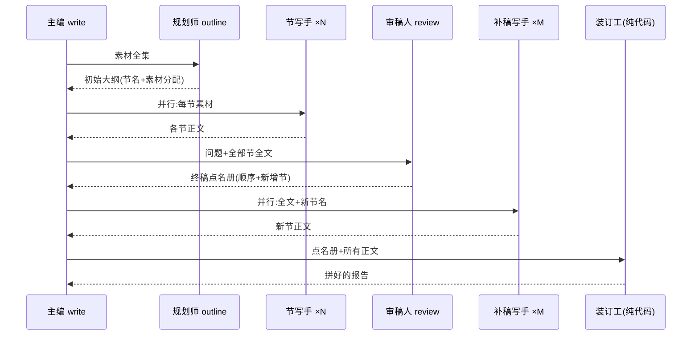

# 零基础讲透:REPORT_REVIEW(审阅+补节)的六条遗留/风险

> **缘起**:report 分节生成新加了"审阅+补节"机制,[审查报告](../../../modify-code-runs/report-review-supplement/review-report.md)的"遗留/风险"一节列了六条,每条只有一两句话。本文把这六条给零基础读者讲透:每条风险先讲**它说的机制是什么**,再讲**什么情况下会咬人**,最后给**你自己核实的办法**(可点击的代码/日志地址)。
> **读法**:§1-§3 是地基(机制+一个贯穿全文的手算例子),§4 是六条风险正文,§5 追问区,§6 术语表。已经清楚机制的可以直接跳 §4。

## TL;DR

六条风险里,**没有一条是"已知会出错"**:三条是设计取舍(②默认开+废弃、③单节跳过、④漏列补尾),两条是说明性质(①怎么验证的、⑥代码环境状态),只有一条是真实的待验证项——**⑤真实 LLM 下审阅质量未验**,它由 B 臂冒烟的 1 题来补。

## 1. 地基:report 是怎么被"分节+审阅"生成的

一篇 report 的生成现在有**四步**(前三步是原有的,第四步套装是新加的):

1. **规划**:一次 LLM 调用看全部素材(findings),出一份大纲——分几节、每节叫什么、用哪些素材。节的**初始顺序**在这里就定了。
2. **写节**:每节独立发一次 LLM 调用**并行**生成正文(每节只拿分给它的素材)。
3. **审阅**(新):节全部写完后,再发一次 LLM 调用,把**问题+全部节的全文**喂给它,要它输出一份"终稿大纲"——已有节的最终顺序,以及要**新增**哪些节(如引言/结论)、插在哪。
4. **补节+装订**(新):新增的节各发一次调用并行生成(也能看到全部已有节全文,只写增量);最后**纯代码**按终稿大纲把所有节拼起来,再附确定性生成的 References。

**桥句(记住这句,后面反复用):审阅调用输出的是一份"完整点名册"——终稿里每个位置放谁,一个萝卜一个坑;代码只负责照单排座,不改任何一节的内容。**

### 先认人,再看图

- **主编** = `FinalWriter.write`:总入口,决定走哪条生成路线;
- **规划师** = outline 调用(tag `FINAL_REPORT_OUTLINE_JSON`):出初始大纲;
- **节写手** = 每节一次的生成调用(tag `FINAL_REPORT_MARKDOWN`);
- **审稿人** = 审阅调用(tag `FINAL_REPORT_REVIEW_JSON`):出终稿点名册;
- **补稿写手** = 新增节的生成调用(tag `FINAL_REPORT_ADDITION_MARKDOWN`);
- **装订工** = 纯 Python 代码:照点名册排座、拼接、附 References——**不经过任何模型**。



**源码钉子**:主编分流在 [agents.py:874-878](../../deep_researcher_demo/agents.py#L874-L878)(`REPORT_REVIEW` 开→`_write_reviewed`,关→老路线原样);规划+写节 [agents.py:147-225](../../deep_researcher_demo/agents.py#L147-L225);审稿人调用 [agents.py:931](../../deep_researcher_demo/agents.py#L931);点名册净化 [agents.py:940-956](../../deep_researcher_demo/agents.py#L940-L956);补稿写手 [agents.py:958-974](../../deep_researcher_demo/agents.py#L958-L974);装订 [agents.py:975-989](../../deep_researcher_demo/agents.py#L975-L989)。

## 2. 手把手:一个能手算的例子

贯穿全文的玩具例:问题"咖啡怎样影响睡眠?",规划师出了 3 节草稿:

| 编号 | 节名 | 正文(缩写) |
|---|---|---|
| [1] | 咖啡因的作用机制 | Body₁ |
| [2] | 对入睡与深睡的影响 | Body₂ |
| [3] | 个体差异与耐受 | Body₃ |

审稿人看完全文,输出点名册(JSON):

```json
{"sections": [
  {"id": 0, "title": "引言"},
  {"id": 2}, {"id": 1}, {"id": 3},
  {"id": 0, "title": "结论"}
]}
```

记法:`id>0` = "把已有的第 id 节放这里";`id:0` + title = "在这里插一个叫 title 的**新**节"。于是终稿顺序 = 引言(新写)→ [2] → [1] → [3] → 结论(新写)。补稿写手只写"引言""结论"两篇,装订工照单拼接。

**这个例子的输入输出不是编的**:它与单测 [test_review_reorder_and_additions](../../tests/test_report_review.py#L120) 的场景同构,该测试对最终整篇 markdown 做**逐字节**断言,已在 [run-1.log:11](../../../modify-code-runs/report-review-supplement/run-1.log#L11) 验过。

### 单步显微镜:点名册"净化"逐步表

审稿人是 LLM,点名册可能出错(重复点名/点不存在的人/漏点)。装订前有一道**纯代码净化**([agents.py:940-956](../../deep_researcher_demo/agents.py#L940-L956))。拿一份故意出错的点名册 `[{id:2},{id:2},{id:99}]` 手走一遍(3 个已有节):

| 步 | 读入项 | 判定 | 座位表 slots | 已点名 seen |
|---|---|---|---|---|
| 1 | {id:2} | 合法且首次 → 收 | [旧2] | {2} |
| 2 | {id:2} | **重复** → 丢弃 | [旧2] | {2} |
| 3 | {id:99} | **越界**(只有 3 节)→ 丢弃 | [旧2] | {2} |
| 收尾 | 补漏:1、3 没被点名 | **按原顺序补到尾部** | [旧2, 旧1, 旧3] | {1,2,3} |

终稿 = 节2 → 节1 → 节3:顺序也许不理想,但**三节一节不丢**。这正是风险④的机制。此场景=单测 [test_no_content_loss](../../tests/test_report_review.py#L151),同样逐字节断言过([run-1.log:13](../../../modify-code-runs/report-review-supplement/run-1.log#L13))。

## 3. 地基二:这次改动是怎么被"验证"的(为风险①⑤做铺垫)

验证一段代码有两条常用路:

- **埋点**(instrumentation):往**生产代码**里临时塞打印/断言(比如在某分支加 `print("MCDBG_xxx")`),把真程序跑起来,看日志里有没有出现该标记。适合"只有真跑起来才知道"的行为(GPU、并发、外部服务)。用完必须清干净——所以约定统一前缀(如 `MCDBG_`)方便一把 grep 删掉。
- **单测**(unit test):不跑真程序,用一个**假的 LLM 客户端**(stub:你问它什么 tag,它照剧本回什么答案)把被测函数在测试进程里跑一遍,直接断言输出。适合"逻辑给定输入必给定输出"的行为。

这次改动的所有验收走的都是**第二条路**:审阅/补节/净化/装订全是确定性逻辑,stub 剧本一喂,输出逐字节可断言——**不需要**往 agents.py 里塞任何一行临时打印。这就是"生产代码零临时埋点"的意思(风险①详解见 §4)。

## 4. 六条风险逐条讲透

### ① "生产代码零临时埋点" —— 这是好消息,不是风险

**说的是**:为了验收,这次**没有**往生产代码里塞过任何临时调试代码(无 MCDBG 标记),所以也**不存在**"忘了清埋点、脏代码留在仓库里"的风险——往期任务(如 attn-guided)收尾都要专门 grep 清埋点,这次这一步天然为零。验证全靠单测(§3);顺带新增的两个调用 tag(`FINAL_REPORT_REVIEW_JSON`/`FINAL_REPORT_ADDITION_MARKDOWN`)不是埋点,是**长期正式信号**——它们写进每次调用的 LLM_CALL_LOG,实验断言"审阅确实发生了/补了几节"就 grep 它们。
**自己核实**:`grep -rn MCDBG deep_researcher_demo/` 应为 0;tag 定义在 [agents.py:931](../../deep_researcher_demo/agents.py#L931) 与 [agents.py:958-974](../../deep_researcher_demo/agents.py#L958-L974)。

### ② REPORT_REVIEW 默认开(终审改) + SUMMARY_PARALLEL 已废弃

**说的是**:新机制由环境变量 `REPORT_REVIEW` 门控,**默认开**(2026-07-20 终审拍板:不设=开,显式 `REPORT_REVIEW=0` 才关;关闸时代码路径与改动前一模一样,验收 A1 逐字节作证)。B 臂 driver 仍显式写 `REPORT_REVIEW=1` 表明意图([run_arm.sh:20](run_arm.sh#L20));它只在 REPORT_PARALLEL 分节路径内生效,A 臂不开分节,天然不受影响。另外"分节"这套引擎原本有两个用户:report(REPORT_PARALLEL)和 summary(SUMMARY_PARALLEL)。用户已拍板:**分节只用于 report,SUMMARY_PARALLEL 作废弃处理**——代码保留但任何实验不得设该 env([agents.py:523-526](../../deep_researcher_demo/agents.py#L523-L526) 有 DEPRECATED 标注)。
**什么时候咬人**:仅当有人未来误设 SUMMARY_PARALLEL=1——所以实验断言里一直保留 sumOL=0(summary 无 outline 调用)这条。

### ③ 单节报告跳过审阅

**说的是**:如果规划师只出了 1 节(或其他节全空),审稿人直接不请([agents.py:918](../../deep_researcher_demo/agents.py#L918))。理由:一个人排什么座次;给单节报告补引言/结论,边际价值低而成本照付。
**什么时候咬人**:几乎不会——benchmark 报告一般 5-8 节;若真出现大量单节报告,那是**规划师**的问题,不该由审稿人补救。

### ④ 审阅漏列的节按原序补尾(顺序退化,零丢失)

**说的是**:§2 的净化表已手算过——审稿人漏点名的节,代码把它们按**原相对顺序**接到座位表尾部。设计权衡是把"**不丢内容**"放在"顺序最优"之上:LLM 出的点名册不可全信,宁可顺序难看,不可整节蒸发。
**什么时候咬人**:审稿人大面积漏列时,报告后半段顺序退化成"原序尾巴"。缓解:提示词明令"每个已有节恰好列一次"([agents.py:746](../../deep_researcher_demo/agents.py#L746));B 臂跑完可统计漏列率(对比每题审阅 JSON 与节数)。

### ⑤ 真实 LLM 下审阅质量未验 —— 唯一真正的待验证项

**说的是**:单测里审稿人是 stub,剧本是我写的;**真模型**会不会出靠谱的点名册(顺序合理?补的引言/结论有信息量?会不会疯狂漏列触发④?)——没验过,单测原则上也验不了。
**怎么补**:B 臂冒烟那 1 题,人工看三样:该题审阅 JSON 原文(LLM_CALL_LOG 里 tag=FINAL_REPORT_REVIEW_JSON 那条)、补出来的引言/结论正文、终稿顺序是否比草稿顺序更合理。冒烟不过关(如全漏列/补节复读机),停下来报告,不硬跑 40 题。

### ⑥ 工作区本有非本任务的未提交改动

**说的是**:deep_researcher_demo 仓库在本次动手**之前**就有一批没提交的修改(llm.py/workflow.py 等,属之前的实验演进)。所以"这次到底改了什么"不能看 `git diff`(会把旧账混进来),要看 run 目录里的**净 diff**:改前快照 vs 改后文件,只含本任务的 269+25 行([net-diff-agents.patch](../../../modify-code-runs/report-review-supplement/net-diff-agents.patch)、[net-diff-schemas.patch](../../../modify-code-runs/report-review-supplement/net-diff-schemas.patch))。
**什么时候咬人**:回滚或复现时拿 git 当账本就会错;以净 diff 为准。

## 5. 追问区(预判的坑)

- **"审阅失败会不会把已写好的节弄丢?"** 不会。审阅 JSON 解析失败(连修复重试也失败)→ 点名册按空处理 → 净化的"补漏"步把**全部**节按原序排回去,输出与不开审阅一模一样(单测 [test_review_garbage_falls_back](../../tests/test_report_review.py#L141) 逐字节验过)。
- **"补节失败呢?"** 单个补节调用抛异常 → 该新节正文为空 → 装订工跳过空节,报告少一节新增但原有节完好([test_addition_failure_skipped](../../tests/test_report_review.py#L168))。
- **"补尾会不会把'结论'补到中间?"** 不会。补尾只作用于**已有节**;新增节(引言/结论)的位置由点名册里它自己的槽位决定,审稿人把结论放最后,它就在最后。
- **"为什么新节上限是 3?"** 防审稿人放飞自我(点名册塞 10 个新节把报告写成新报告)。引言+结论+至多一个漏盖面,3 够用;超出的静默丢弃。
- **"为什么不删 SUMMARY_PARALLEL 的代码只标废弃?"** 删代码是新的行为改动,要重走一轮验收;标废弃+任何实验不设 env,效果等同且零风险。等下次大清理再删。
- **"埋点和单测到底选哪个?"** 逻辑确定、输入输出可枚举 → 单测;只有真机真跑才暴露的(GPU/时序/并发) → 埋点。本次前者;B 臂冒烟本质上是后者(拿真模型验⑤)。

## 6. 术语表 + 人话↔源码对照

| 人话 | 源码/文件 |
|---|---|
| 主编(总入口) | `FinalWriter.write` [agents.py:874-878](../../deep_researcher_demo/agents.py#L874-L878) |
| 规划师(初始大纲) | tag `FINAL_REPORT_OUTLINE_JSON`,[agents.py:147-225](../../deep_researcher_demo/agents.py#L147-L225) |
| 审稿人(终稿点名册) | tag `FINAL_REPORT_REVIEW_JSON`,[agents.py:931](../../deep_researcher_demo/agents.py#L931) |
| 点名册 | `ReportReview.sections`,[schemas.py:52](../../deep_researcher_demo/schemas.py#L52) |
| 点名册净化(去重/丢越界/补漏) | [agents.py:940-956](../../deep_researcher_demo/agents.py#L940-L956) |
| 补稿写手 | tag `FINAL_REPORT_ADDITION_MARKDOWN`,[agents.py:958-974](../../deep_researcher_demo/agents.py#L958-L974) |
| 装订工(纯代码拼接) | [agents.py:975-989](../../deep_researcher_demo/agents.py#L975-L989) |
| 埋点 | 往生产代码临时塞的调试打印(本次为零) |
| stub / 单测 | 假 LLM 按剧本答题,`tests/test_report_review.py` |
| golden | 预先算好的期望输出,断言逐字节相等 |
| 净 diff | 改前快照 vs 改后的纯本任务差异(run 目录 *.patch) |
| 交接闸 | 审查报告交用户终审、通过前不算完成 |
