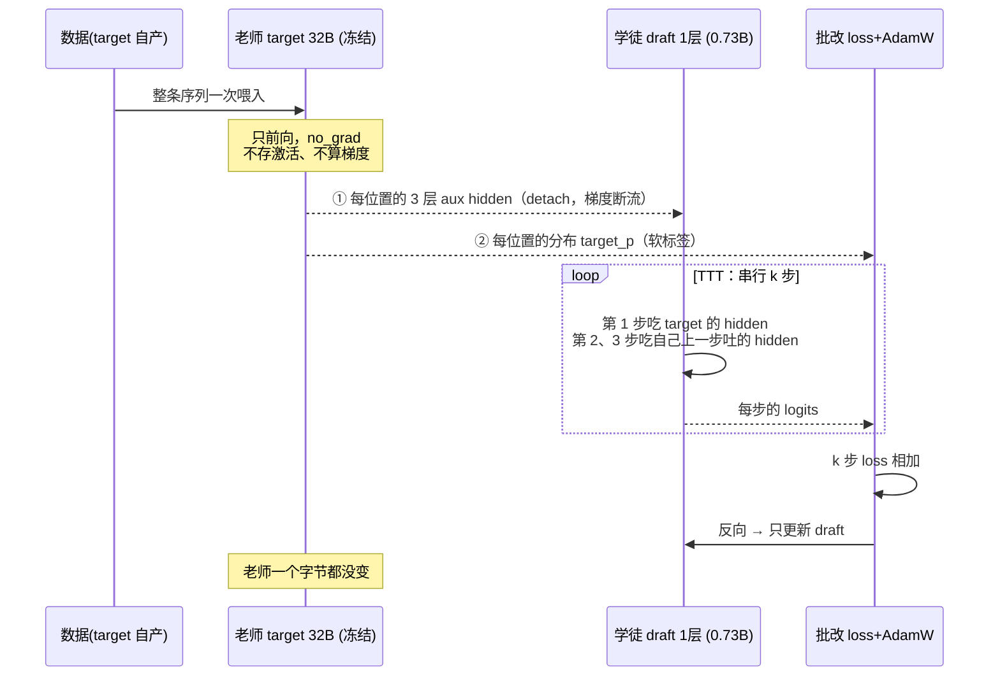

# 全参微调 vs EAGLE-3 微调：显存为什么是 `320KB × L × k`

> **缘起**：EAGLE-3 方案里那些看不懂的结论——"冻结了为什么还要跑 1-2 天"、"参数少激活反而是大头"、"显存要 ×L×k"、"降 max_length 是唯一杠杆"——不是孤立的坑，全部来自**同一个公式**。本文从"一个模型是怎么训练的"讲起，把这个公式一层层推出来，最后用它挖出一块**没开采过的显存**（§11：可能让 max_length 拉回 16384）。
>
> **读法**
>
> | 你的情况 | 从哪读 |
> |---|---|
> | 只要结论 | **TL;DR** + **§12 对照总表** |
> | **只想搞懂显存为什么 ×L×k** ← 本文重点 | **§1.4–1.7**（公式的地基）→ 直接跳 **第三部分（§6–§10）** |
> | 想搞懂 EAGLE 为什么这么设计 | **§3 → §5** |
> | **想省显存 / 想把 max_length 拉回 16384** | **§11.0 关键证据**（90% 的 draft 激活是白付的）→ §11 全节 |
> | 从头读通 | §1 → §12 顺着走，每节只引入一个新想法 |
> | 可跳过 | §13 追问区、§14 术语表、§15 进阶、§16 源码钉子 |
>
> 全文 **5 条桥句**（标 ⭐），是后文反复回指的支点。看到 ⭐ 请停一下。

---

## TL;DR

**一句话定性**：

> **全参微调改变模型"说什么"；EAGLE-3 微调不改变模型说什么，只改变它"说得多快"——输出必须逐 token 与原模型等价。**

**一句话定量**（本文重点）：

```
激活显存 = 每环 320KB  ×  链数 L  ×  每链的环数 k
           └ 一行走完 ┘   └ 起跑点 ┘  └ TTT 步数 ┘

           320KB × 8192 × 3 = 7.5 GiB
```

它和全参微调是**同一个公式**，只是最后一个因子不同：

```
全参微调:  260KB × 8192 × 64  (64 层 × 各经过 1 次)  = 130 GiB
EAGLE-3 :  320KB × 8192 × 3   (1 层  × TTT 走 3 次)  = 7.5 GiB
                              └──── 唯一的区别 ────┘
```

| | 全参微调 | EAGLE-3 微调 |
|---|---|---|
| **改的是什么** | 模型的行为（输出内容变了） | 只加速；**输出严格不变**（数学保证） |
| **训哪些参数** | 全部 32B | 1 层 draft ≈ **0.73B（2.3%）**，target 全冻 |
| **标准答案从哪来** | 数据集里写好的答案 | **target 自己现算的概率分布**（软标签） |
| **模型输入** | token | token embedding + **target 的 3 层 hidden** |
| **数据要求** | 高质量即可 | **必须 target 自产**（on-policy） |
| **独有机制** | — | **TTT**：串行展开 k 步，练"吃自己吐的 hidden" |
| **激活显存 @8K** | 130 GiB | 7.5 GiB |
| **总显存 @8K** | ~614 GiB（≈14 张 48G 卡） | ~46 GiB/卡 × 4 |
| **时间大头** | 反向传播 | **target 的前向**（~65%，而它是冻结的！） |
| **训坏了会怎样** | 模型胡说、灾难性遗忘 | **只会变慢，一个字都不会错** |

---

# 第一部分：地基——激活到底是什么

## §0 起点确认

假设你已经知道：transformer 层里有 attention 和 MLP；推理是自回归的（一次前向吐一个 token）。

**不需要**知道反向传播细节——§1 从头讲，深度刚好够撑起那个公式。

## §1 一个模型是怎么训练的

### 1.1 训练就是四步循环

拿一条数据 `[AI, 发展, 得, 很, 快, 。]`（t₁…t₆）教模型"预测下一个词"：

| 步骤 | 干了什么 |
|---|---|
| ① **前向** | token 喂进去，一层层算，输出 logits |
| ② **算 loss** | 猜测 vs 标准答案，差多少 = loss（一个**标量**） |
| ③ **反向** | 从 loss 倒推：每个权重 W 该往哪挪一点点 = 梯度 |
| ④ **更新** | AdamW 拿梯度改 W |

### 1.2 teacher forcing：L 行并排走

训练**不是**一个个生成的。整条真序列一次喂入，**每个位置各自预测下一个**：

| 位置 i | 模型看到 | 该预测 |
|---|---|---|
| 1 | AI | 发展 |
| 2 | AI 发展 | 得 |
| 3 | AI 发展 得 | 很 |

**一次前向，L 行并排走，产出 L 个 loss 项。** 记住这个画面——§1.6 和整个第三部分全靠它。

### 1.3 显存里躺着四类东西

| 名字 | 是什么 | 大小取决于 |
|---|---|---|
| **参数** | 模型本体的矩阵 W | 参数量 |
| **梯度** | 每个 W 配一个同形状的"该往哪挪" | 参数量 |
| **优化器状态** | AdamW 的动量 m、v + fp32 主权重 | 参数量 |
| **激活** | ⚠️ **前向算出来、为了反向能用而留着的中间结果** | **数据量** |

前三类都 ∝ 参数量。**第四类是所有反直觉的源头，也是本文的主角。**

### 1.4 ⭐ 桥句 A：为什么必须存激活

反向传播算某个权重 W 的梯度：

```
grad_W = 输入激活ᵀ × 输出梯度
```

> **⭐ 桥句 A：要知道 W 该怎么改，你必须知道"前向时到底是什么数据流过了它"。**

所以前向时，**流过每个矩阵乘法的输入张量都得原地留着**——这就是**激活**。

**全文统一的比喻**：

> **参数 = 车间里有多少台机器；激活 = 流水线上堆了多少个零件。**

### 1.5 ⭐ 桥句 B：什么时候可以不存

> **⭐ 桥句 B：一层要不要存激活，看梯度的回程路经不经过它。**

能不存要**同时**满足：① 不对它的参数求梯度（冻结）；② 梯度也不需要**穿过**它去更上游。

⚠️ 别记成"冻结就不存"。反例钉死：**只训 embedding、冻结所有中间层 → 中间层激活照样全存**（梯度要穿过它们回到 embedding）。

### 1.6 ⭐ 桥句 C：×L 从哪来（外积求和）

回到 1.2 的画面：**L 行并排走** → 中间结果不是向量，是**矩阵**。

拿 MLP 下投影 `W_down` 举例（激活里最大的一件）：

```
前向:  U = SiLU(X·W_gateᵀ) ⊙ (X·W_upᵀ)    U ∈ [L, 25600]   ← 每行一个位置
       O = U · W_downᵀ                     O ∈ [L,  5120]
```

按桥句 A，`∂L/∂W_down` 需要 `U`。写成矩阵：

```
     ∂L
 ─────────  =  Gᵀ · U          G = ∂L/∂O ∈ [L, 5120]
  ∂W_down      [5120,L]·[L,25600] = [5120,25600] ✓ 与 W_down 同形状
```

**按元素拆开——这一行是全文的钥匙**：

```
 ∂L/∂W_down [a][b]  =   Σ      G[i][a] · U[i][b]
                       i=1..L
                       └ 对"位置"求和 ┘
```

> **⭐ 桥句 C：每个位置贡献一个外积 `G[i,:] ⊗ U[i,:]`，梯度 = L 个外积之和。**
> **要把它们加起来，L 份东西必须同时在场。** ← `×L` 的全部理由。

**手算验证**（缩到 L=4、宽度 3→2）：

```
U = ⎡1 2 3⎤   G = ⎡1 0⎤     逐位置外积 G[i,:] ⊗ U[i,:]:
    ⎢0 1 0⎥       ⎢0 2⎥       i=1: [[1,2,3],[0,0,0]]
    ⎢2 0 1⎥       ⎢1 1⎥       i=2: [[0,0,0],[0,2,0]]
    ⎣1 1 1⎦       ⎣0 1⎦       i=3: [[2,0,1],[2,0,1]]
                              i=4: [[0,0,0],[1,1,1]]
                              和 : [[3,2,4],[3,3,2]]
直接算 Gᵀ·U = [[3,2,4],[3,3,2]]  ✅ 一致（numpy 核过）
```

**位置 4 的那份外积，直到最后求和才被用到——你不能算完位置 1 就把 `U[1,:]` 扔掉。**

### 1.7 通用显存公式

```
激活显存 ≈ 每位置的中间张量 × L × 梯度要路过的"层实例"个数
             └ 桥句 A 决定 ┘  └ 桥句 C ┘  └───── 桥句 B 决定 ─────┘
```

**"层实例"** = 梯度回程路上，一个 transformer 层被**经过了几次**。记住这个词——**§2 和第三部分的唯一区别就在它**。

---

## §2 全参数微调：套公式（层实例 = 64）

**没有新概念**——就是 §1，W 取遍 Qwen3-32B 的每个矩阵。

**教什么**：数据集里的答案就是标准答案。**模型的行为被改变了。**

```
每位置的中间张量 ≈ 260 KB   （每层 ~130K 元素：norm 20K + QKV 10K + RoPE 9K + attn/o 13K + MLP 77K）
层实例个数       = 64       （64 层各经过 1 次；梯度从最后一层流到第一层，全都要存）

激活 = 260KB × 8192 × 64 = 130 GiB
```

**完整账单**（L=8192）：

| 项 | 大小 | 随 L 涨？ |
|---|--:|:--:|
| 权重 bf16（32B×2B） | 60 GiB | ✗ |
| 梯度 bf16 | 60 GiB | ✗ |
| AdamW m+v（fp32，32B×8B） | 238 GiB | ✗ |
| fp32 主权重 | 119 GiB | ✗ |
| **训练态小计** | **477 GiB** | 固定 |
| **激活** | **130 GiB** | **✓** |
| 词表 logits | 7 GiB | ✓ |
| **合计** | **~614 GiB ≈ 14 张 48G 卡** | |

（所以全参微调 32B 必须 ZeRO-3 + **梯度检查点**——只存 64 个层边界 hidden（~5 GiB），层内激活反向时重算，~30% 算力换 25 倍显存。）

---

# 第二部分：EAGLE-3 的机制（`k` 是怎么冒出来的）

## §3 插播 30 秒：为什么会有 draft

推理时每吐一个 token，都要把 **64GB 权重从显存搬进计算单元一整遍**。搬运是瓶颈，算力在打瞌睡——**一趟搬运只换 1 个 token，太亏了**。

投机解码：

1. 便宜的 **draft** 先猜出接下来 k 个 token；
2. target **一次前向**并行验证这 k+1 个位置（成本和吐 1 个 token 差不多——**都只搬一趟权重**）；
3. 猜对的白赚；从第一个猜错处截断，用 target 的正确 token 接上。

**关键性质**：接受/拒绝规则保证**输出分布与不加速时完全一致**。

> **draft 猜得再烂，输出也不会错，只会因为白干而变慢。**

## §4 EAGLE-3 的 draft 是什么

### 4.1 ⭐ 桥句 D：从"推理那一刻你手里有什么"推出输入格式

推理进行到某一刻——target 刚跑完位置 `i`，你手上有：

- `h_i`：target 在位置 i 的 hidden（它的"想法"）；
- `t_{i+1}`：从 `h_i` 采样出的 token（它"说出口的话"）。

要猜 **`t_{i+2}`**，你能用的**就只有这两样**。所以 draft 的形状别无选择：

```
draft( concat( embed(t_{i+1}) , fc(a_i) ) )  →  ĥ_{i+1}  →  draft_lm_head  →  t̂_{i+2}
                                └ §4.3 会说明这个 fc；后文简写作 h_i ┘
```

> **⭐ 桥句 D：draft 的输入格式不是设计出来的，是"推理那一刻手里有什么"逼出来的。**

### 4.2 ⚠️ 下标对齐（最容易读错的一处）

```
位置 i:         1        2        3        4        5        6
token t_i:     AI      发展       得       很       快       。
target hidden: h₁       h₂       h₃       h₄       h₅       h₆
                ↑ "读完 AI 之后的想法"（因果：h_i 只看得到 t₁..t_i）
```

`h₁` 是 token `AI` 位置的 hidden。但重点在**它是谁的产地**：

```
h₁ ──lm_head──► 采样 ──► t₂ = 发展
```

**位置 i 的 hidden 正是用来产出 t_{i+1} 的那个 hidden**。所以输入对 `(h₁, emb(发展))` 看着错位，**其实是同一时刻的两面**：

> **h₁ = target 吐出"发展"那一刻的想法；`发展` = 它实际说出口的词。** → 据此猜 t₃。

**为什么不用 h₂？** 推理那一刻 **h₂ 根本不存在**——target 刚吐完 `发展` 就把控制权交给 draft 了。（记住这句，§5.3 要用。）

⚠️ 本文 **1-indexed**；SpecForge 源码 0-indexed，靠左移 `input_ids` 实现错位。

### 4.3 EAGLE-3 里的"3"：三层 hidden 融合（附全文记号约定）

target 交出的不是最后一层，而是**低/中/高三层**（64 层里取 ~2/32/61）拼起来，再用 `fc` 压回 5120：

```
target 的 3 层 aux hidden:   a_i = concat(h_low, h_mid, h_high)   ∈ R^15360
                              ↓  fc  （权重形状 5120 × 15360）
draft 用的 hidden 槽:         fc(a_i)                              ∈ R^5120
                              ↓  concat( emb 5120 )
draft 层的输入行:             X_i                                   ∈ R^10240
```

铁证：`q_proj.weight` 形状 `(5120, 10240)`——**输入宽度 10240 = 5120 embed + 5120 hidden**，hidden 半边只能是**过完 fc 的**（raw 是 15360，塞不进去）。

#### ⚠️ 全文记号约定

```
a_i    ≜ target 的 3 层 aux hidden 拼接（15360 维，raw）
h_i    ≜ fc(a_i)（5120 维）      ← 后文所有图里的 h_i 都指这个（已过 fc）
ĥ⁽ʲ⁾   ≜ draft 第 j 环的输出（5120 维，不过 fc）
```

#### 🎯 fc 只在环 1 跑一次，不 ×k

```
环 1:  hidden 槽 = fc(a₄)   ← 过 fc（target 的 15360 → 5120）
环 2:  hidden 槽 = ĥ⁽¹⁾     ← 不过 fc！draft 自己的输出本来就是 5120
环 3:  hidden 槽 = ĥ⁽²⁾     ← 不过 fc
```

**fc 是"翻译官"**：把 target 的语言（15360）翻成 draft 的语言（5120）。**draft 自己的输出本来就说 draft 的语言，不用再翻译。**

→ **`fc` 的激活（= 它的输入 `a_i`，15360 元素/位置）`×L` 但 `×1`，不 ×k**。它已经算在 §10 的 **"老师交付物：3 层 hidden 0.23 GiB"** 里了（`8192 × 15360 × 2B = 0.23 GiB` ✅），**没有重复计价**。

**为什么要三层**：最后一层的 hidden 已被"挤压成"预测下一个词的形状，中间语义丢了；三层混合让 draft 看到更完整的"target 在想什么"。

**推论**：**draft 的输入是 target 的内脏。没有 target 跑一遍前向，draft 连输入都没有。**

#### ⚠️ 关于全文的 `ĥ⁽¹⁾ ≈ h₅` 那个"≈"

它是**功能上的**，不是**被强制的**：

- **EAGLE-1** 有一条显式的 **feature 回归 loss**，硬逼 `ĥ` 逼近真 feature；
- **EAGLE-3 把这条 loss 删掉了**，只留 token 分布对齐 + TTT。

所以 `ĥ⁽ʲ⁾` 是"**填在那个槽里、被端到端训得好用**"的向量，**不是被强行拽向 `h` 的向量**——它可能差得挺远，只要在槽里能让下一环猜准就行。

（这让 §9.2 的结论更强：`ĥ ≠ h` 不仅没被强制相等，**连"应该相等"的约束都被 EAGLE-3 主动删掉了**。）

### 4.4 draft 词表只有 32000（t2d / d2t）

target 词表 151936，draft 只留高频 32000。`t2d`/`d2t` 是两张 id 互转查表。

⚠️ **它们和 draft lm_head 的每一行绑死**。续训时**绝不能用新数据重算**——重算一次，lm_head 每行都对错了词。（= 补丁 #1）

### 4.5 ⭐ 桥句 E：标准答案不是语料，是 target 本人

```
loss = 让 draft 的分布  逼近  target 在同一位置的概率分布
                              ↑ 软标签，代码里叫 target_p，训练时现算
```

> **⭐ 桥句 E：draft 的任务不是"猜正确答案"，是"猜 target 会说什么"。**

**推论 1 —— 数据必须 target 自产（on-policy）。** 拿人写的答案训，你在教 draft 模仿人；可推理时它要预测的是 **Qwen3-32B 的口癖**。
→ 你们 harvest 的 `content` 本来就是 Qwen3-32B temp=0 自产的——**天生正确，白捡**。

**推论 2 —— target 的前向省不掉。** 它同时是 ① draft 输入的来源 ② 标签的来源。**冻结的它，是"生产训练数据的机器"。**

## §5 训练闭环

### 5.1 先认人

- **老师 target（冻结，只前向）**：交付每个位置的 3 层 aux hidden（学徒的输入）+ 概率分布（批改的答案）。**它自己不学。**
- **学徒 draft（唯一在学）**：1 层 + fc + lm_head，~0.73B 可训。
- **批改（loss + AdamW）**：只更新学徒。



### 5.2 单步：每个位置一条样本

序列 `[AI, 发展, 得, 很, 快, 。]`，target 前向后产出 `h₁…h₆`：

| 位置 i | draft 的输入 | 该猜 | 标签 |
|---|---|---|---|
| 1 | concat(embed(**发展**), **h₁**) | 得 | target 在位置 2 的分布 |
| 2 | concat(embed(**得**), **h₂**) | 很 | target 在位置 3 的分布 |
| 3 | concat(embed(**很**), **h₃**) | 快 | target 在位置 4 的分布 |
| 4 | concat(embed(**快**), **h₄**) | 。 | target 在位置 5 的分布 |

和 §1.2 一样：**一次前向，L 行并排走。每个位置都是一条独立的训练样本。**

### 5.3 TTT：`k` 的由来

**问题**：5.2 教的全是"**吃 target 的真 hidden** → 猜下一个词"。可推理时（§3 + §4.2）：

| 第几个草稿 | 输入的 hidden 从哪来 | 训练见过吗 |
|---|---|---|
| 第 1 个 | target 的真 hidden | ✅ |
| 第 2 个 | **target 还没跑呢！** 只有 draft 自己刚吐的 `ĥ`（带误差） | ❌ **没见过** |
| 第 3 个 | draft 第 2 步的 `ĥ`，误差再叠一层 | ❌ 更没见过 |

训练没见过"吃自己吐的带误差 hidden"→ 推理第 2 步走进没学过的分布，错会滚雪球。病名：**exposure bias**。

**TTT（Training-Time Test）= 训练时提前排练这条接力**：把 draft **串行展开 k 步**。

#### ⚠️ 定义"链"和"环"（本文自造的比喻词，后面反复用）

| 说法 | 定义 | 对应到 | 代码里 |
|---|---|---|---|
| **起跑点 / 链** | 一个序列位置 i 的 k 步接力 | loss 网格的**一列** | 矩阵的第 i 行 |
| **环** | **一次草稿预测** = 1 行输入 × 1 次 draft 前向 → 1 份 logits → 1 个 loss 项 → **320KB 激活** | loss 网格的**一个格子** (i,j) | 第 j 步矩阵里的第 i 行 |
| **接力棒** | 上一环的输出 `ĥ` 当下一环的输入 | — | `for idx in range(self.length)` 传递的 hidden |

#### 单起点的接力棒（序列 `A B C D E F G H`，从 D 起跑，k=4）

target 已跑到 D，交出 **h₄**，并据此吐出了 **E**：

```
target ──► h₄
             │
  环1  输入 [ emb(E) ‖ h₄  ] ──► 输出 ĥ₅ ─┐   猜 F      320KB
                                          │
  环2  输入 [ emb(F) ‖ ĥ₅  ] ──► 输出 ĥ₆ ─┐   猜 G      320KB
                                          │
  环3  输入 [ emb(G) ‖ ĥ₆  ] ──► 输出 ĥ₇ ─┐   猜 H      320KB
                                          │
  环4  输入 [ emb(H) ‖ ĥ₇  ] ──► 输出 ĥ₈       猜 t₉     320KB
       └── 上一环的输出接下一环的输入，所以叫"链" ──┘
```

**重叠检查**：

| 槽 | 四环的取值 | 重叠？ |
|---|---|---|
| token 槽 | `E, F, G, H` | **四个不同的词，0 重叠** |
| hidden 槽 | `h₄, ĥ₅, ĥ₆, ĥ₇` | **四个不同的向量，0 重叠**；后三个在上一环跑完前**根本不存在** |

> **TTT 不是"把同一件事算 k 遍"，而是"算一条 k 环的接力链"——环环相扣，拆不开。**

**为什么 token 用真值、hidden 用自产？** 环 j 的前提是"前 j-1 个草稿都被接受了"，被接受 = 与真序列一致 = ground truth token；但 hidden 必须自产，因为推理那一刻 target 压根没跑过那些位置。

---

# 第三部分 ★ 显存为什么是 `320KB × L × k`

> **这是全文的核心。三个因子，一节一个。**

## §6 总纲：三个因子

```
激活 = 每环 320KB   ×   链数 L    ×   每链环数 k
       └─ §7 ─┘        └─ §8 ─┘       └─ §9 ─┘
       一行走完         有多少个        每条链
       draft 层         起跑点          排练几步
       留下什么

       320KB  ×  8192  ×  3  =  7.5 GiB
```

**一个环 = loss 网格的一个格子 = 一个 loss 项** ⇒ 也可以读成：

> **激活 ≈ loss 项个数（L×k）× 每项 320KB。**

对照 §1.7 的通用公式——**同一个公式**，只是"层实例数"从"64 层×1 次"变成"1 层×k 次"。

---

## §7 因子一：每环 320KB

draft 单层、每个位置、每一环，autograd 要留下的中间张量（hidden 5120；draft 的 q = 64 头 × 80 = 5120，kv = 8 头 × 80 = 640；MLP 中间 25600；draft 词表 32000）：

| 部件 | 元素数 | 为什么必须存（桥句 A） |
|---|--:|---|
| 拼接后的 X（embed 5120 ‖ hidden 5120） | 10,240 | q/k/v 三个矩阵乘**共享的输入** |
| 两个 RMSNorm 的输入（emb 半边 + hidden 半边） | 10,240 | RMSNorm 有可训权重，要存自己的输入 |
| q/k/v 投影输出（5120 + 640 + 640） | 6,400 | q/k 是 RoPE 的输入，v 是 attention 的输入 |
| RoPE 后的 q' / k' | 5,760 | flex_attention 的输入 |
| attention 输出 + lse | 5,184 | attention 输出是 o_proj 的输入 |
| o_proj 输出 | 5,120 | |
| post_attention_norm 输入 | 5,120 | |
| **MLP gate 输出**（SiLU 的输入） | **25,600** | ┐ |
| **MLP up 输出**（逐元素乘的操作数） | **25,600** | ┘ **MLP 合计 51,200（31%）**——中间宽度是 hidden 的 5 倍 |
| **CE 的 fp32 log_softmax**（32000 × 4B，折成 bf16 元素） | **64,000（39%）** | **单项最大**——loss 要 fp32 |
| **合计** | **163,264 × 2B = 319 KB ≈ 320 KB** | |

⚠️ **`lm_head` 的 bf16 logits（32,000）不计入**：`log_softmax` 的反向只需要**它自己的输出**（那份 fp32），bf16 logits 用完即可释放。（很容易多算一遍，我第一次核就多算了。）

**记住这两个大件：MLP 31% + logits 39% = 71%**——§9 证明它们**无法跨环复用**，§11 证明 **prompt 位置的它们可以整个省掉**。

---

## §8 因子二：×L（链数 = 起跑点数）

### 8.1 输入不是 `[1, 10240]`，是 `[L, 10240]`

很多人以为 draft 的输入是一行。**那是推理的形状。** 训练时喂进去的是**矩阵**：

```
                    ←──────────── 10240 列 ────────────→
                    ┌──── embed 5120 ────┬──── hidden 5120 ────┐
      位置 1  ──→   │    emb(发展)       │        h₁           │  ← 一条训练样本
      位置 2  ──→   │    emb(得)         │        h₂           │  ← 一条训练样本
 L 行 位置 3  ──→   │    emb(很)         │        h₃           │
      位置 4  ──→   │    emb(快)         │        h₄           │
        ⋮           │       ⋮            │        ⋮            │
      位置 8192 ─→  │    emb(…)          │      h₈₁₉₂          │
                    └────────────────────┴─────────────────────┘
                          X⁽¹⁾  shape = [8192, 10240]

前向 = 一次矩阵乘，吃掉所有行：
   X⁽¹⁾[8192,10240] · W_qᵀ[10240,5120] → Q⁽¹⁾[8192,5120]
                     └ 权重 1 份 ┘        └ 8192 行结果 ┘
```

| | 输入形状 | 为什么 |
|---|---|---|
| **推理** | `[1, 10240]` | 只有一个"当前位置"，历史在 KV cache 里 |
| **训练的每个 TTT 步** | **`[L, 10240]`** | L 个位置**同时**都是"当前位置" |

**同一个 draft 层，两种喂法。** 而且这不是 EAGLE 特有的——全参微调某层的输入是 `[L, 5120]`，一模一样（§1.2）。

### 8.2 ⭐⭐ 前缀 = 矩阵里编号更小的行（为什么是 L 不是 L²）

**"从 D 起跑"需要 attention 看到前缀 A/B/C——它们从哪来？**

```
                  ┌─── embed 5120 ───┬─── hidden 5120 ───┐
row1  起点 A ──►  │    emb(B)        │       h₁          │
row2  起点 B ──►  │    emb(C)        │       h₂          │
row3  起点 C ──►  │    emb(D)        │       h₃          │
row4  起点 D ──►  │    emb(E)        │       h₄          │  ← ★ "从 D 起跑"那一行
row5  起点 E ──►  │    emb(F)        │       h₅          │
  ⋮
```

attention 时，**row4 的 Q 去看 row1…row4 的 K/V（因果）**：

> **前缀 A/B/C 不是额外喂进来的东西——它们就是别的起跑点自己的那一行。**

**一行两用**：row3（起点 C 的第 1 环）同时也是 row4 的**前缀 KV**。训练里根本没有独立的"前缀前向"。

**这个复用值 4000 倍**：

```
不复用的世界：              实际世界（复用）：
  起点 1 : 1 行
  起点 2 : 2 行（前缀+自己）    step1 的矩阵一共 8192 行
  起点 3 : 3 行                每行既是"起点 i 的第 1 环"
    ⋮                          又是"所有 j>i 的前缀"
  起点 L : L 行
  ────────────────
  ≈ L²/2 ≈ 3,400 万行 😱   ←→        8,192 行  ✅
```

> **`L²/2` 被压成了 `L`。公式里那个 `L` 本来就是"复用之后"的数字——重复计价根本没发生。**

**加一个起跑点，每步只多 1 行**：

| | step1 | step2/3/4 |
|---|---|---|
| 只训 D | rows 1,2,3,**4** | 每步 1 行 |
| 训 D+E | rows 1,2,3,4,**5** ← 只多 1 行 | 每步 2 行 |
| 全训 | 8192 行 | 每步 8192 行 |

### 8.3 口径：矩阵行数 ≠ 算 loss 的行数

> **矩阵的行数 = 序列长度 L**（attention 必须有前缀）
> **算 loss 的行数 = 你选择训练的位置数**
> 标准做法里两者**恰好相等**（每个位置都训）——所以到处都是 L。

**两种行，两种价钱**（§11 的优化全靠这张表）：

```
前缀行：X → k/v 就停                                    （只为给别人当 attention 的 K/V）
训练行：X → q/k/v → attn → o_proj → MLP → logits → loss  （走完全程，而且 ×k）
        └ 前缀行只走了这一小段 ┘
```

**前缀行逐项**：

| 部件 | 元素数 |
|---|--:|
| 拼接后的 X（k/v 投影的输入） | 10,240 |
| 两个 RMSNorm 的输入 | 10,240 |
| k/v 投影输出 | 1,280 |
| RoPE 后的 k' | 640 |
| **合计** | **22,400 × 2B = 44 KB** |

| 行的角色 | 每位置每环 | ×k？ |
|---|---|---|
| **算 loss 的行**（训练行） | **320 KB** | ✅ |
| **只当前缀的行** | **44 KB**（便宜 **7.3 倍**） | ❌ **不 ×k**（输入是 target 的真 hidden，固定不动，算一遍后复用） |

**320KB = 44KB（前缀那一段）+ 275KB（后半程）**——把"便宜 7.3 倍"拆开看：

| | 元素数 | 归属 |
|---|--:|---|
| 拼接后的 X | 10,240 | ┐ |
| 两个 RMSNorm 的输入 | 10,240 | ├ **前缀行也要付：44 KB** |
| k / v 投影输出 | 1,280 | │ |
| RoPE 后的 k' | 640 | ┘ |
| q 投影输出 | 5,120 | ┐ |
| RoPE 后的 q' | 5,120 | │ |
| attention 输出 + lse | 5,184 | │ |
| o_proj 输出 | 5,120 | ├ **只有训练行付：275 KB** |
| post_attn_norm 输入 | 5,120 | │ |
| **MLP gate + up** | **51,200** | │ ← ┐ |
| **CE 的 fp32 log_softmax** | **64,000** | ┘ ← ┘ **这两件占后半程的 82%** |
| **合计** | **163,264 = 320 KB** | `44 + 275 = 319` ✅ |

**"能跳过"不是我们的选择，是梯度的性质**（回扣**桥句 B**）：

> **前缀行对 loss 的唯一贡献，是它的 K/V 被训练行 attend 到。**
> 它自己的 attention 输出 / MLP 输出 / logits——**没有任何 loss 消费它们**。
> → **梯度的回程路根本不经过那些算子** → 那 275KB **本来就是白付的**。

⚠️ **注意两点**：

1. **target 的 3 层 aux hidden（`a_i`，15360/位置）不在这 44KB 里**——它是老师那边单列的一笔（§10 表的 `0.23 GiB`），前缀行和训练行都要用它。
2. ⚠️ **现状是白付了**：SpecForge **不区分这两类行**，把 L 个位置全当训练行，prompt 的每一行也在付 320KB × k。`loss_mask` 只把**梯度**归零（数学上对），**显存已经付过了**。→ 这就是 **§11** 的全部机会。

### 8.4 反事实：只训一个位置，还要 ×L 吗？

序列长 8192，**只在位置 8100 算 loss**，k=4：

| 行 | 数量 | 每行每环 | ×k？ | 小计 |
|---|--:|--:|---|--:|
| **前缀行**（row1…8099） | 8,099 | **44 KB** | ❌ **不 ×k**（输入是 target 真 hidden，固定不动，算一遍后复用） | **~340 MiB** |
| **训练行**（8100 那条链的 4 环） | 4 | 320 KB | ✅ | ~1.3 MiB |
| **合计** | | | | **≈ 0.33 GiB** |

三个数字别搞错：

| 算法 | 结果 | |
|---|--:|---|
| `8100 × 4 × 320KB` | 10 GiB | ❌ 高估 30 倍——把前缀行当成了训练行 |
| `4 × 320KB` | 1.3 MiB | ❌ 低估——忘了前缀 K/V 也是激活（`grad_W_k` 要用） |
| **`8099×44KB + 4×320KB`** | **0.33 GiB** | ✅ |

**但你其实在问："能不能把 batch size 从 L 降到 1？"**

> **`×L` 不是 EAGLE 的机制，它就是 batch size。**

| | 训全部 L 个位置 | 只训 1 个位置 |
|---|---|---|
| **target 前向**（占训练时间 **65%**） | 跑一遍整条序列 | **一模一样跑一遍整条序列** |
| 换来的训练样本 | **8192 条** | **1 条** |
| draft 激活 | 7.5 GiB | ~0.2 GiB |
| **每条样本的成本** | 1× | **8192×** |

> **必须 ×L 的理由：target 的前向已经把账付了（65% 的时间），L 个位置全是白送的样本。只训 1 个 = 花同样的钱，拿 1/8192 的货。**

（⚠️ 但"prompt 位置本来就不该算 loss"是另一回事——那不是浪费，是**真的不需要**。这条线索通向 §11 的大优化。）

---

## §9 因子三：×k（环数 = TTT 步数）

**核心问题：k 环之间有重叠吗？没有。** 下面四小节从四个角度证明。

### 9.1 逐行对比：X⁽¹⁾ vs X⁽²⁾

序列 `t₁=AI t₂=发展 t₃=得 t₄=很 t₅=快 t₆=。`

**X⁽¹⁾（环 1 的输入矩阵）**，第 i 行 = `concat( emb(t_{i+1}), h_i )`：

| 行 | token 槽 | hidden 槽 | → 该行输出 | 猜 |
|---|---|---|---|---|
| 1 | `emb(发展)` | **h₁** | **ĥ⁽¹⁾₁** = 对 h₂ 的**估计** | 得 |
| 2 | `emb(得)` | **h₂** | **ĥ⁽¹⁾₂** = 对 h₃ 的估计 | 很 |
| 3 | `emb(很)` | **h₃** | **ĥ⁽¹⁾₃** = 对 h₄ 的估计 | 快 |
| 4 | `emb(快)` | **h₄** | **ĥ⁽¹⁾₄** = 对 h₅ 的估计 | 。 |

⚠️ **环 1 的输出 `ĥ⁽¹⁾` 就是环 2 的原料**——它在环 1 跑完之前**根本不存在**。（"串行"的字面含义。）

**X⁽²⁾（环 2 的输入矩阵）**：每行的故事是*"从位置 i 起跑，第 1 个草稿已出（假设被接受），现在猜第 2 个"*。hidden 本该是 `h_{i+1}`——**但 target 没跑过位置 i+1**，只有 draft 刚吐的 `ĥ⁽¹⁾ᵢ`：

| 行 | token 槽 | hidden 槽 | 猜 |
|---|---|---|---|
| 1 | `emb(得)` | **ĥ⁽¹⁾₁** ← draft 自产 | 很 |
| 2 | `emb(很)` | **ĥ⁽¹⁾₂** ← draft 自产 | 快 |
| 3 | `emb(快)` | **ĥ⁽¹⁾₃** ← draft 自产 | 。 |
| 4 | `emb(。)` | **ĥ⁽¹⁾₄** ← draft 自产 | （越界，mask） |

**并排**：

| 行 | **X⁽¹⁾** | **X⁽²⁾** |
|---|---|---|
| 1 | `[ emb(发展) ‖ h₁ ]` | `[ emb(得) ‖ ĥ⁽¹⁾₁ ]` |
| 2 | `[ emb(得) ‖ h₂ ]` | `[ emb(很) ‖ ĥ⁽¹⁾₂ ]` |
| 3 | `[ emb(很) ‖ h₃ ]` | `[ emb(快) ‖ ĥ⁽¹⁾₃ ]` |
| 4 | `[ emb(快) ‖ h₄ ]` | `[ emb(。) ‖ ĥ⁽¹⁾₄ ]` |

**hidden 半边全是 `ĥ`——一组环 1 之前压根不存在的新数字。L 行全中。**

**逐个张量点名**（环 2 vs 环 1）：

| 张量 | 形状 | 关系 |
|---|---|---|
| `X⁽²⁾` | [L, 10240] | **L 行全新** |
| `Q⁽²⁾` | [L, 5120] | **L 行全新**（`Q = X·W_qᵀ`，X 每行变 → Q 每行变） |
| `K⁽²⁾`/`V⁽²⁾` | [L, 640]×2 | **L 行全新**（训练里没有 KV cache，K/V 现算） |
| **`U⁽²⁾` MLP 中间** | [L, 25600] | **L 行全新**（31%） |
| **`Z⁽²⁾` logits** | [L, 32000] | **L 行全新**（39%） |

> **W 不变（1 份权重），X 每行都变（k×L 行输入）⇒ X 之后的一切都是 k×L 行。**
> **权重共享 ≠ 激活共享。同一台机器，3 批不同原料，3 批不同零件。**

### 9.2 🎯 卡点一："`emb(得)` 不是已经出现过了吗？"

token 半边**确实是平移复用**的（就那几个词，embedding 冻结查表）。但看**整行**：

```
X⁽¹⁾ 第 2 行 = [ emb(得) ‖  h₂  ]     ← hidden = target 的真值
X⁽²⁾ 第 1 行 = [ emb(得) ‖ ĥ⁽¹⁾₁ ]    ← hidden = draft 的估计
                          ↑↑↑
                   ĥ⁽¹⁾₁ ≈ h₂  但  ĥ⁽¹⁾₁ ≠ h₂
```

**"重叠"（数据）≠ "复用"（计算）**——三种重叠逐个点名：

| # | 哪里重叠 | 真的重叠 | 能省显存 |
|---|---|---|---|
| **(a)** | token 半边（平移） | ✅ | ❌ **一点都不能** |
| **(b)** | `ĥ⁽¹⁾` 既是环1输出、又是环2输入 | ✅ 唯一真复用 | 🔶 ~3% |
| **(c)** | `ĥ⁽¹⁾ᵢ` vs `h_{i+1}` | ❌ 不重叠（估计 ≠ 真值） | — |

**(a) 为什么一点都省不下**——**矩阵乘把整行 10240 维混在一起算**。缩成 4 维演示：

```
W_q = ⎡1 0 │ 1 0⎤          W_q 的每一列都跨越两个半边
      ⎣0 1 │ 0 1⎦

行 A = [1, 2 ‖ 3, 4]  → q_A = [1·1+2·0+3·1+4·0 , 1·0+2·1+3·0+4·1] = [4, 6]
行 B = [1, 2 ‖ 5, 1]  → q_B = [1+5 , 2+1]                          = [6, 3]
       └同一半┘└不同┘        token 半边完全相同，输出却没一个数一样
```

> **输入共享 50% ≠ 输出共享 50%。是共享 0%。**
> **激活存的是输出（q / u / logits），不是原料。原料撞脸，产品全新。**

**(b) 只占 3%**：

| 每位置的激活 | 元素数 | 跨环重叠？ |
|---|--:|---|
| **MLP gate/up** | 51,200（31%） | ❌ 每环输入不同 |
| **logits + fp32 softmax** | 64,000（39%） | ❌ 每环各算一份 loss |
| attn/o_proj、QKV、norm | ~38,000（24%） | ❌ 全新 |
| 拼接后的 X | 10,240（6%） | 🔶 hidden 半边 5120 与上一环输出同源 |
| **合计** | 163,000 | **可复用 ≈ 3%** |

**97% 不可复用 → `×k` 站得住。**

**自检**：假如真有 `ĥ⁽¹⁾₁ == h₂`，X⁽²⁾ 就是 X⁽¹⁾ 的平移，TTT 确实白做——但那意味着 draft 已能完美复刻 target 的 hidden，那还训什么？

> **`ĥ ≠ h` 不是 bug，是 TTT 存在的前提。**

### 9.3 🎯 卡点二：两条链"撞脸"（D + E 双起点）

同时训 **D（位置 4）和 E（位置 5）**，k=4。记号：**D 链**产出 `d₁ d₂ d₃`（`d₁` = 对 **h₅** 的估计）；**E 链**产出 `e₁ e₂ e₃`（`e₁` = 对 **h₆** 的估计）。

```
step1  [5, 10240]:
  row1-3 (A,B,C)  前缀，只出 k/v
  row4 (D): [ emb(E) ‖ h₄ ]  ★ D 链环1 → d₁(≈h₅) → 猜 F
  row5 (E): [ emb(F) ‖ h₅ ]  ★ E 链环1 → e₁(≈h₆) → 猜 G

step2  [2, 10240]:
  D 链: [ emb(F) ‖ d₁ ] → d₂(≈h₆) → 猜 G
  E 链: [ emb(G) ‖ e₁ ] → e₂(≈h₇) → 猜 H

step3  [2, 10240]:
  D 链: [ emb(G) ‖ d₂ ] → d₃(≈h₇) → 猜 H
  E 链: [ emb(H) ‖ e₂ ] → e₃(≈h₈) → 猜 t₉
```

**撞脸出现了**：

```
D 链环2:  [ emb(F) ‖ d₁ ]    d₁ = draft 猜的 h₅   → 猜 G
E 链环1:  [ emb(F) ‖ h₅ ]    h₅ = target 的真值   → 猜 G
           └同一个词┘ └不同！┘  └──同一个标签──┘

D 链环3:  [ emb(G) ‖ d₂ ]    d₂ = 走了 2 步的 h₆ 估计   → 猜 H
E 链环2:  [ emb(G) ‖ e₁ ]    e₁ = 走了 1 步的 h₆ 估计   → 猜 H
                     └ 两个都在估计 h₆，但"退化深度"不同！┘
```

规律（= loss 网格的**反对角线**）：

| 都在估计 | D 链提供的 | E 链提供的 |
|---|---|---|
| **h₅** | `d₁`（退化 1 步） | `h₅`（**真值**，0 退化） |
| **h₆** | `d₂`（退化 2 步） | `e₁`（退化 1 步） |
| **h₇** | `d₃`（退化 3 步） | `e₂`（退化 2 步） |

> **TTT 的意义就在这张表里**：让 draft 在 hidden"退化 0/1/2/3 步"的**各种成色**下都能猜准。
> **撞脸 ≠ 重复——它们是同一道题的不同难度版本。**合并 = 假装退化 3 步和退化 0 步是一回事 = TTT 白做。

### 9.4 为什么反向要"从第 k 环穿回第 1 环"

**定性**：TTT 是一个展开 k 步的 RNN，**k 环共享同一套 θ**。反向 = BPTT。

```
g⁽ʲ⁾ = 输入 hidden = { h_target   (j=1，常数，detach，梯度断流)
                     { ĥ⁽ʲ⁻¹⁾    (j≥2，draft 自己上一环吐的)
X⁽ʲ⁾ = concat( Emb(t_{i+j}), g⁽ʲ⁾ )   ∈ [L, 10240]
ĥ⁽ʲ⁾ = DraftLayer( X⁽ʲ⁾ ; θ )         ∈ [L, 5120]
Lⱼ   = CE( ĥ⁽ʲ⁾W_lmᵀ , target_p )     标量
L    = L₁ + … + L_k
```

关键就一行：**`ĥ⁽ʲ⁻¹⁾` 既是环 j-1 的输出、又是环 j 的输入**——它把 k 环焊成一条链。

**"穿回来"是递推式的第 ② 项**（记 δ⁽ʲ⁾ ≡ ∂L/∂ĥ⁽ʲ⁾）：

```
δ⁽ᵏ⁾ = ∂L_k/∂ĥ⁽ᵏ⁾
δ⁽ʲ⁾ = ∂Lⱼ/∂ĥ⁽ʲ⁾  +  J⁽ʲ⁺¹⁾ᵀ · δ⁽ʲ⁺¹⁾        J⁽ʲ⁺¹⁾ = ∂ĥ⁽ʲ⁺¹⁾/∂ĥ⁽ʲ⁾
       └─── ① ───┘     └────── ② ──────┘

k=3 展开： δ⁽¹⁾ = ∂L₁/∂ĥ⁽¹⁾ + J⁽²⁾ᵀ∂L₂/∂ĥ⁽²⁾ + J⁽²⁾ᵀJ⁽³⁾ᵀ∂L₃/∂ĥ⁽³⁾
```

⚠️ 记号严谨性：`Lⱼ` 是**标量**；① 是它**对该环输出 hidden 的偏导**（张量），不是 loss 本身。

**具体求一个参数 `W_down`**：

```
前向:  U⁽ʲ⁾ = SiLU(X⁽ʲ⁾W_gateᵀ) ⊙ (X⁽ʲ⁾W_upᵀ)   ∈ [L, 25600]
       O⁽ʲ⁾ = U⁽ʲ⁾ W_downᵀ

反向（θ 在 k 环共享 ⇒ 对 k 环求和）:
    ∂L        k
 ─────────  = Σ  ( G⁽ʲ⁾ )ᵀ · U⁽ʲ⁾           G⁽ʲ⁾ = ∂L/∂O⁽ʲ⁾
  ∂W_down    j=1
```

**两颗钉子**：

1. 求和项里 **U⁽¹⁾, U⁽²⁾, U⁽³⁾ 全都要在场** → k 份激活**同时驻卡**；
2. **G⁽¹⁾ ← δ⁽¹⁾ ← δ⁽²⁾ ← δ⁽³⁾** → 必须先算完第 3 环反向再回到第 1 环 → **U⁽¹⁾ 是最后才被消费的，从头活到尾，不能提前释放**。

**手算（标量版，数值验证过）**：DraftLayer 简化成 `h_out = w·h_in`，k=2，h₀=1，w=2：

```
h₁ = w·h₀ = 2      (环 1 吃 target 的 hidden)
h₂ = w·h₁ = 4      (环 2 吃自己吐的 h₁)
L  = 0.1·h₁ + 0.5·h₂

dL/dw = 0.1·h₀            ← 路径 A：环 1 里的 w
      + 0.5·( h₁ + w·h₀ ) ← 路径 B：环 2 里的 w
                             h₁    = w 显式出现在环 2
                             w·h₀  = w 藏在 h₁ 里面 ← 这就是"穿回第 1 环"
      = 0.1 + 0.5·(2+2) = 2.1
验证: L(w)=0.1w+0.5w² → dL/dw = 0.1+w = 2.1 ✅（中心差分 2.1000000）
```

**路径 B 是钉子**：要算它，手里必须有 `h₁`（环 1 的激活）——哪怕你只关心环 2 的 loss。

**反事实（隔离出 ×k 的根因）**：假如 k 环各自都吃 target 的真 hidden（互相独立、没有链），δ 的第 ② 项消失 → 可以"一环前向 → 一环反向 → 释放 → 下一环"，梯度累加，**显存 ×1**。

> **`×k` 不是因为"算了 k 个 loss"，而是因为"环 j 吃环 j-1 的自产 hidden"这条链。而这条链正是 TTT 存在的全部理由。你花的显存买的就是它。**

---

## §10 合起来：全卡显存账

```
每环 320KB  ×  L=8192 链  ×  k=3 环  =  7.5 GiB
```

| 项 | GiB/卡 | 随 L 涨？ |
|---|--:|:--:|
| target 权重（TP4 分片，冻结） | 16.8 | ✗ |
| target KV 池（SGLang 静态） | ~3.1 | ✗ |
| draft 参数（1.65 可训 + 1.45 冻结 embed） | ~3.2 | ✗ |
| draft 优化器 + 梯度（FSDP ÷4） | ~3.0 | ✗ |
| 老师交付物：3 层 aux hidden `a_i`（L×15360×2B） | 0.23 | **✓ ∝L**（不 ×k，§4.3） |
| 老师交付物：`target_p`（L×151936×4B，分片÷4） | 1.16 | **✓ ∝L**（不分片 4.64；L=12288 时 6.95 → **OOM 现场**） |
| **draft TTT 激活 = 320KB × L × k** | **7.5** | **✓ ∝L×k** |
| 　└ 其中 MLP 等：194KB × L × k | (4.5) | 　*（拆分项，不另计）* |
| 　└ 其中 fp32 log_softmax：126KB × L × k | (3.0) | 　*（拆分项，不另计）* |
| CUDA ctx / NCCL / flex 工作区 / 碎片 | ~2-4 | ~ |
| **合计** | **~37-42**（实测 L=10240 时 45.25） | 47.4 可用 → **骑线** |

⚠️ **别双重计价**：`320KB` 里**已经含了 logits（39%）**。原方案文档把 "TTT 激活" 和 "各步 logits" 分成两行相加——那是重复的。上表用缩进的"其中"表示拆分。

**和 §2 的 614 GiB 并排看——"只训小 head"的全部红利就在这里。**

**但最扎眼的一行**：占显存最大的**单项**是 **draft 的激活（7.5 GiB）**——一个只有 1 层的小模型；而**冻结的 64 层 target 一份激活都不存**（桥句 B，详见 §13 Q1）。

### 三个旋钮，拧的是同一个乘法

| 办法 | 拧哪个因子 | 现状 |
|---|---|---|
| **降 TTT 步数**（7 → 3） | **k** | ✅ 已用（~17 → 7.5 GiB），顺带对齐部署 k=3 |
| **降 max_length**（12288 → 8192） | **L** | ✅ 已用 |
| 梯度检查点 | 每环 320KB | ❌ SpecForge 无此 flag |
| 序列并行 USP | L | ❌ 只支持 offline → 磁盘不够 |
| **🆕 prompt 位置不算 loss** | **每环 320KB → 25KB** | ⬅️ **§11：没开采过** |

---

# 第四部分：§11 未开采的优化（可能让 max_length 回到 16384）

> **线索**：§8.3 那张"两种行、两种价钱"的表 + 一个事实——**你们的 prompt 根本不该算 loss。**

## ⭐ 11.0 关键证据：**90% 的 draft 激活是白付的**

一行一行地对账（L=8192，prompt 7692 行 / assistant 500 行，k=3）：

```
prompt 行【现在付】:  320KB × 3 环  =  957 KB / 行
prompt 行【只需付】:   44KB × 1     =   44 KB / 行
                                     ─────────────
                       每行浪费        913 KB
                         ├ 走了不该走的后半程:  275KB × 3 环 = 825 KB
                         └ 前缀段被重复付 3 次(应 ×1): 44 × 2 =  88 KB

    913 KB × 7,692 个 prompt 位置  =  6.70 GiB   ← 纯浪费

校验:  现状 7.47 GiB  −  优化后 0.78 GiB  =  6.70 GiB  ✅
```

> # **draft 激活 7.47 GiB 里，6.70 GiB（90%）花在了"永远不会产生梯度"的 prompt 位置上。**

**为什么是"永远不会产生梯度"**（回扣**桥句 B**）：prompt 行对 loss 的唯一贡献是**它的 K/V 被训练行 attend 到**。它自己的 attention 输出 / MLP 输出 / logits——**没有任何 loss 消费它们**，梯度回程路根本不经过那些算子。

**为什么现在还是付了**：`loss_mask` 只把**梯度**归零（数学上对，你们的 loss=0 事故就是它的存在证明），但

> **mask 在 loss 层，不在计算层——显存已经付过了。**

---

## 11.1 你们的数据结构

summary 样本：**prompt ≈ 7,700 token，assistant ≈ 500 token**。

```
[ ────────── prompt ~7,692 位置 ────────── ][ assistant ~500 位置 ]
        loss_mask = 0（不算 loss）              loss_mask = 1
```

**只有 ~6% 的位置真正贡献 loss。**（这也正是 max_length 截断会把 loss 砍成 0 的原因——loss 区全在尾巴上。）

## 11.2 prompt 行到底需要什么

| 张量 | prompt 行需要吗 | 为什么 |
|---|---|---|
| target 的 3 层 aux hidden `a_i` | ✅ **需要** | 过 fc 后当 prompt 行 X 的 hidden 槽 → 算前缀 K/V |
| draft 的 X + norm 输入 + K/V（**44 KB**） | ✅ 需要 | 当前缀（§8.3） |
| **target 的 `target_p`（软标签）** | ❌ **不需要** | 只有算 loss 的位置才用 ← 分片后 **1.16 GiB**（不分片 4.64） |
| draft 的 Q / attn / o_proj / MLP | ❌ 不需要 | 它的输出没人用（不算 loss，也不起跑链）← **MLP 占 31%** |
| **draft 的 logits + fp32 softmax** | ❌ **不需要** | ← **占 39%，且是那个炸点** |

**两处 logits 加起来，正好是你们 OOM 报错里点名的那两个**：teacher 全词表 fp32（`--shard-target-output` 就是为它加的）和 draft 的 fp32 softmax。

## 11.3 算账（L=8192，prompt 7692 / assistant 500，k=3）

| | 现状 | **A：只干掉两处 logits** | **B：再加"prompt 行只到 k/v"** |
|---|--:|--:|--:|
| draft 激活（**含** logits） | **7.47 GiB** | **4.72 GiB** | **0.78 GiB** |
| teacher `target_p`（分片后） | 1.16 | **0.07** | 0.07 |
| **省下 / 卡** | — | **≈ 3.8 GiB** | **≈ 7.8 GiB** |

（现在单卡骑在 47.4 GiB 的线上。省 3.8 GiB 就从"骑线"变"宽裕"。）

## 11.4 🎯 真正的大礼：`max_length` 几乎变免费

**加长 max_length 加的全是 prompt**（assistant 恒定 ~500 token）。所以激活对 L 的斜率：

```
优化前：每多 1 个 token → 320KB × k = 957 KB   （它是一条完整的链）
优化后：每多 1 个 token →          44 KB       （它只是一个前缀行）
                                   └─ 斜率降 21.9 倍 ─┘
```

| L | draft 激活（现状） | draft 激活（优化 B 后） |
|---|--:|--:|
| 8192 | 7.5 GiB | **0.78 GiB** |
| 12288 | 11.2 GiB | **0.95 GiB** |
| **16384** | 14.9 GiB（必 OOM） | **1.12 GiB** |

> **从 8192 拉到 16384，激活只涨 0.34 GiB。**
> 而你们的数据 **p90 = 14328**（16K 覆盖 98.8%）——这正是方案文档里想要、却被迫放弃的那个长度。
>
> **这可能是把"唯一可靠杠杆 = 降 L"那句结论翻案的钥匙。**

⚠️ 但别忘了**其他 ∝L 的项也会跟着涨**（老师的 3 层 hidden 0.23→0.47 GiB；`target_p` 若不优化 1.16→2.3 GiB；target 的 KV 池占用翻倍）——所以 16384 要成立，**🥈（teacher 只在 loss 位置算 `target_p`）是必做项**，不是可选项。

## 11.5 落地建议

| 优先级 | 改什么 | 难度 | 收益 |
|---|---|---|---|
| **🥇** | draft `lm_head` 前 gather：`lm_head(hidden[loss_mask])` 而非 `lm_head(hidden)` | **一行 index_select**，不动 attention | 干掉 draft logits（39% 的激活）+ **fp32 softmax 炸点** |
| **🥈** | teacher 只在 loss 位置算 `target_p` | 低（同理 gather） | 干掉 4.64 GiB 那一笔——**你们 L=12288 OOM 的元凶** |
| **🥉** | prompt 行只走到 k/v，不进 MLP | 高（要改 attention 的 varlen 逻辑） | 再省 ~3 GiB（MLP 占 31%） |

**🥇+🥈 数学上完全等价**（被 mask 的位置梯度本来就是 0），**零风险**。

**先去核实一件事**：SpecForge 是不是在"先全算、再 mask loss"——

```python
logits = lm_head(hidden)          # [L, 32000]  ← 全部 8192 个位置都算了
loss = CE(logits, target_p)       # [L]
loss = (loss * loss_mask).sum()   # ← 到这一步才把 prompt 的 7692 个扔掉
                                  #    但 7692 份 logits 的显存已经付过了
```

**mask 在 loss 层，不在计算层。** 你们遇到的 loss=0 事故恰恰证明 loss mask 是存在的——但**它保证的是"梯度对不对"，不是"显存花不花"**。

## 11.6 两个心眼

1. **prompt 的最后一个位置是有效起跑点**——推理时 prefill 结束后的第一次投机，正是从最后一个 prompt token 起跑的。gather 时别把它裁掉。
2. **这只解显存的困，不解时间的困**。**target 前向那 65% 一分不省**——8192 个 token 照样要过 target 的 64 层（§13 Q2）。

---

# 第五部分：合起来看

## §12 对照总表

| 维度 | 全参数微调 | EAGLE-3 微调 |
|---|---|---|
| **目的** | 改变模型说什么 | 不许改变说什么，只让它说得快 |
| **可训参数** | 32B（100%） | 0.73B（2.3%）；target + draft embedding 全冻 |
| **模型输入** | token ids | token embedding **+ target 的 3 层 hidden**（桥句 D） |
| **标准答案** | 语料里写好的下一个词 | **target 现算的概率分布**（桥句 E） |
| **数据** | 任意高质量答案 | **必须 target 自产**；2K-19K 条域内样本即见效 |
| **loss 项个数** | L | **L × k** |
| **激活公式** | 260KB × L × **64**（64 层 × 1 次） | 320KB × L × **3**（1 层 × TTT 3 次） |
| **总显存 @8K** | ~614 GiB | ~46 GiB/卡 × 4 |
| **时间大头** | 反向传播 | **冻结的 target 的前向（~65%）** |
| **产物** | 一个新的 32B 模型 | 一个 ~1.5GB 的 head，原模型原封不动 |
| **训坏了** | **模型胡说（质量事故）** | **只是变慢（性能事故，质量零风险）** |
| **验收指标** | 各种质量分 | **接受率 / AL / 加速比**——不看任何质量分，**因为质量不可能变** |

## §13 追问区

**Q1：为什么冻结的 64 层 target 一份激活都不存，而要训的那 1 层反倒是显存第一大项？**

桥句 B：**看梯度的回程路经不经过它。**

target 两条都占：① 权重冻结，不用求梯度；② draft 拿到的 hidden 是 **detach** 的（梯度到此断流），梯度也不需要**穿过**它。→ **零激活。**

draft 反过来：唯一在训，梯度要流过它的每个矩阵乘，而且流过 **k 次**。→ 激活大头。

⚠️ 反例钉死：**只训 embedding、冻结中间层 → 中间层激活照样全存**（梯度要穿过它们回到 embedding）。判据不是"这层训不训"，是"梯度回程经不经过"。

> **存不存激活看"梯度路不路过"，存多少看"喂了多少数据"，都不看参数多少。**

---

**Q2：既然只训 2.3% 的参数、target 还冻着，为什么还要跑 1-2 天？**

冻结省掉的是**反向和优化器**，**省不掉前向**（§4.3 / §4.5 推论 2）：draft 的**输入**是 target 的 3 层 hidden，**标签**是 target 的分布。

**每个训练 token 都必须过一遍 target 的 64 层前向**，online 模式下每 epoch 重跑。

账：135M token/epoch × 3 epoch ÷ (4 卡 prefill ~2-3K tok/s) ≈ **40-55 小时**。成分：**老师前向 ~65%** + TTT 展开 ~12% + draft 反向 ~18%。

**offline 模式的意义**：target 前向只跑一遍存盘 → 每 epoch 几小时。代价是磁盘（~4TB，fp8 压到 ~1TB）；你们 `/data` 剩 169GB → 堵死。

---

**Q3：harvest 不是已经存了 target 的输出吗？为什么还要重跑 target？**

harvest 省的是**让 target 逐 token decode 生成回复**（造数据最烦的一步，你们 temp=0 自产白送）。

但 harvest 存的是 **token**，不是 **hidden states**（30KB/token，存不起）。而 draft 的输入是 hidden。**没存就得重算。**

---

**Q4：和 LoRA 有什么区别？不都是"只训一小撮参数"吗？**

- **LoRA**：少训参数，但**目的就是改变 target 的输出**。它是"经济版的全参微调"。
- **EAGLE-3**：**不许改变 target 的输出，一个字节都不许**。外挂加速器，本体不动。

> **LoRA 是"便宜地改行为"；EAGLE 是"根本不改行为"。**

---

**Q5：训坏了会怎样？**

| | 全参微调训坏 | EAGLE-3 训坏 |
|---|---|---|
| 症状 | 模型胡说、丢失能力 | draft 猜不中 → **净减速**（实测 0.92-0.97×） |
| 输出质量 | 变差 | **逐 token 完全不变**（§3 无损保证） |
| 后果 | 线上事故 | 白花钱，退回 vanilla |

所以验收判据（P0 ≥15.1% / P1 ≥20% / P2 ≥35%）**全是接受率**，一个质量指标都没有。

---

**Q6：`--max-length` 限的是什么？为什么它能让 loss 变成 0？**

限的是**整条样本**（system+user+assistant 渲染后）的 token 上限，**超长从尾部截断**。

⚠️ assistant 在末尾，样本超长时**被砍掉的正是 loss 区** → loss 静默变 0，框架不报警。这正是 `max_length=4096` 冒烟时 loss=0 的根因。

它同时是显存主旋钮（公式里的 `L`）。

---

**Q7：推理时也有 TTT 的显存问题吗？**

没有。**贵的是"训练态"，不是"长序列"本身**：推理时激活即算即扔、无 TTT 链、无优化器——同一张卡 serving 40960 上下文都没事。

## §14 术语表

| 词 | 一句话 |
|---|---|
| **参数 / 权重** | 模型本体的矩阵；不随数据长度变 |
| **激活** | 前向算出、为反向保留的中间张量；**= 每环字节 × L × k**，与参数量无关 |
| **层实例数** | 梯度回程路上一个 layer 被经过几次：全参微调 = 64 层×1；EAGLE-3 = 1 层×k |
| **链**（自造） | 一个起跑点（位置 i）的 k 步接力；= loss 网格的一列 = 矩阵的第 i 行 |
| **环**（自造） | 一次草稿预测 = 1 行 × 1 次 draft 前向 → 1 个 loss 项 → **320KB 激活**；**上一环的输出是下一环的输入**，拆不开 |
| **梯度** | "权重该往哪挪"，与权重同形状 |
| **优化器状态** | AdamW 的 m/v + fp32 主权重；全参微调显存最大项 |
| **detach** | 切断梯度回传；target 交给 draft 的 hidden 是 detach 的 → target 零激活 |
| **梯度检查点** | 只存层边界 hidden，层内反向时重算；~30% 算力换 ~25 倍激活显存 |
| **teacher forcing** | 整条真答案一次喂入，L 个位置各自预测下一个 |
| **on-policy 数据** | target 自己生成的回复；EAGLE 的硬要求（桥句 E 推论 1） |
| **exposure bias** | 训练只见过"真输入"，推理却要吃"自产带误差输入"，错会滚雪球 |
| **TTT** | 训练时串行展开 k 环、每环吃自己上一环的 hidden；治 exposure bias，代价是激活 ×k |
| **BPTT** | 沿展开的时间链反向传播；TTT 的反向就是 BPTT |
| **aux hidden states** | EAGLE-3 取的低/中/高三层 hidden（~2/32/61），拼接后 fc 压回 5120 |
| **t2d / d2t** | draft 3.2 万词表 ↔ target 15 万词表的映射；与 lm_head 行序绑死，续训不可重算 |
| **接受率 / AL** | 草稿被接受的比例 / 平均每步接受长度；EAGLE 唯一的验收指标 |

## §15 进阶（跳过不影响理解）

**EAGLE-1 → 2 → 3**：EAGLE-1 用最后一层 hidden + "预测下一个 hidden"的回归 loss；EAGLE-2 改进草稿树的动态构造；EAGLE-3 **去掉 hidden 回归 loss**、改用**三层 hidden 融合**、引入 **TTT**。三条改动都指向：让 draft 更贴合 target 的真实推理时输入分布。

**和经典知识蒸馏的关系**：都是学 teacher 的分布。但蒸馏的学生是**独立模型**，EAGLE 的学生**寄生**在 teacher 的内脏（hidden）上——不需要理解世界，只需要读 target 的心思；且有 verification 兜底，学得粗糙也不会出错，只是慢。这就是为什么 1 层、0.73B 就够。

**为什么域内数据管用**：draft 学的是"target 在这类输入上的口癖"，而口癖**域相关**——通用 chat 数据训的 head 到中文研究总结场景，AL 从 2.15-2.49 掉到 1.40-1.61。反过来只要 2K-19K 条**域内 on-policy** 样本就能显著搬动接受率（arXiv 2503.07807）。

## §16 源码钉子

⚠️ 本文写作时未挂载仓库目录，以下坐标**取自方案文档，未逐一核对**，因此没做成可点击链接。

| 人话概念 | 源码坐标 |
|---|---|
| TTT 串行展开 k 环（§5.3） | `specforge/core/eagle3.py` — online forward 的 `for idx in range(self.length)`，`self.length` = `--ttt-length` |
| TTT 步数默认 7 | `train_eagle3.py:183` |
| 老师给的软标签（§4.5） | `target_p` |
| 三层 aux hidden 的融合投影（§4.3） | draft 的 `fc`，权重形状 `(5120, 15360)` |
| 词表映射（§4.4） | `t2d`/`d2t`；`load_vocab_mapping`（补丁 #1 在 `train_eagle3.py:1036` 跳过它） |
| 推理时"第 2 环吃自产 hidden"（§5.3） | vLLM `eagle.py`：`input_ids=draft_token_ids_list[-1]` + `self.hidden_states=`上一步输出 |
| TTT 的花式 mask（§8.2） | `specforge/modeling/draft/flex_attention.py` — `generate_eagle3_mask` |
| **§11 要核的两处** | draft `lm_head` 调用前有没有按 `loss_mask` gather；teacher `target_p` 是不是全 L 计算 |

---

**相关文档**：本文管"原理与显存公式"；训练怎么跑、踩了哪些坑（RoPE buffer 未初始化致 loss=nan、HF datasets 按路径缓存、max_length 截断吃掉 loss 区）见 `EAGLE-3 域内训练方案` §四c 踩坑账本，两者互不重复。
