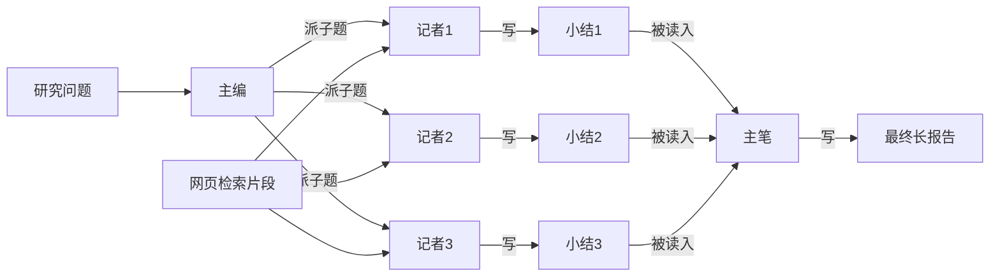
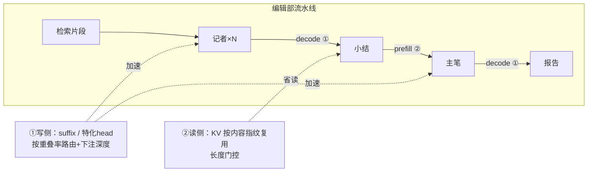

# Once Generated, Many Times Served —— 论文故事零基础讲解

> **缘起**：论文骨架（特征清单/工作量映射/缺口/弱点）在 [Once Generated.md](Once%20Generated.md)，那份是给"已经在做这个项目的人"看的速记。本文是**零基础版**：不假设你懂推理系统，从"LLM 是一个字一个字往外蹦的打字机"讲起，把整个故事讲到你能复述给别人听。
> **读法**：§1–§8 按顺序读，每节只引入一个新想法；"追问区""进阶"可跳过，忘了名词去"术语表"查。全文用**同一个比喻（编辑部）**和**同一个手算例子（电动车报告）**贯穿。
> **数字口径**：正文所有真实数字都来自本项目实测，段末"证据钉子"给出处；手把手例子为教学缩小版，缩了哪些参数会当场注明。

---

## TL;DR

deep research agent 生成一篇报告的过程，像一个编辑部的流水线：记者把检索到的资料抄进小结，主笔再把小结抄进报告。**同一段文字只被"创作"了一次，但系统按"从零创作"的价格给它反复结账**——重抄一遍付一遍"写字钱"（decode），重读一遍付一遍"读入钱"（prefill）。论文做三件事：①第一次系统地量出这件事有多严重（照抄率、什么调用抄得多、什么调用在真创作）；②在"写"这头省钱：照抄型调用用"查资料抄"的投机解码（suffix），创作型调用给模型配一个用本编辑部历史稿件培训过的"读心速记员"（特化 EAGLE-3），**按"这次调用大概会抄多少"路由**；③在"读"这头省钱：上游写小结时做过的"笔记"（KV）直接传给下游，不再重读（decode-to-prefill KV reuse）。端到端已兑现的数字：40 题总耗时 9293s → 4879s，**接近腰斩**。

---

## §1 编辑部：deep research agent 是什么

deep research agent 是一类"替你做深度调研"的 AI 系统：你丢给它一个问题（比如"2025 年全球电动车市场格局如何？"），它自己上网搜索、读网页、汇总，最后交给你一篇几千字带引用的研究报告。

它内部不是一个模型一口气写完的，而是**多次调用 LLM，各司其职**，像一个编辑部：

| 编辑部角色 | 干什么 | 系统里的名字 |
|---|---|---|
| **主编** | 把大问题拆成几个子题，派活 | supervisor / planner（产出 query_plan） |
| **记者**（3–5 个并行） | 各自检索网页，把资料写成**小结** | researcher（产出 RESEARCH_SUMMARY） |
| **主笔** | 读所有小结，写成最终**长报告** | writer（产出 FINAL_REPORT_MARKDOWN） |

每个角色每开口一次 = 一次独立的 LLM 调用。规模感受一下：我们录了 100 个研究问题的完整运行痕迹（trace），一共 **1912 次生成调用**；主笔写报告时，光"读入"的材料（所有小结+指令）就有 **约 8.5 万字符 ≈ 2 万 token**。

> **桥句①：报告不是一个人从零写的，是一条流水线层层"转抄 + 加工"出来的。** 后面所有内容都建立在这句话上。

先认人，再看图——上面三个角色在流水线里这样接力：

**证据钉子**：调用规模与角色构成见 [../summary.md](../summary.md)；报告 prompt 规模见 [paper-skeleton.md](../explore-idea/paper-skeleton.md) §三 P1。

---

## §2 LLM 干活的两个动作：读（prefill）与写（decode）

要懂这篇论文省的是什么钱，只需要懂 LLM 推理的两个阶段。

**读（prefill）**：模型开始回答前，要先把整个 prompt（指令+材料）"读一遍"。读的过程中，它为**每个 token**（模型处理文字的最小单位，约等于一个词或半个词；本文的手算例子用"字"代替，道理相同）记一份"笔记"——这份笔记术语叫 **KV cache**：后面每写一个字，都要回头翻所有笔记来决定下一个字。prefill 可以整段并行算，所以快；它决定的是**首字延迟**（TTFT，Time To First Token：从发出请求到蹦出第一个字的等待时间）。

**写（decode）**：然后模型**一个字一个字**往外蹦。每蹦一个字，都要把这个字过一遍整个模型、并翻一遍全部笔记——所以写 1000 字就要跑 1000 趟。这是慢的根源。

本负载实测：**decode 占了 GPU 计算量的约 95%**。

> **桥句②：贵的是"写"，不是"读"。** 这句话决定了论文里谁是主菜（decode 侧优化）谁是配菜（prefill 侧优化）——后面 §7 会用到。

**证据钉子**：decode/prefill 占比实测见 LMCache 侧文档（`/home/yilin/LMCache/claude-docx/11`，绝对路径，仓库外）；e2e 墙钟里小结/报告/检索三段占比 32.8%/27.8%/31.8% 见 [paper-skeleton.md](../explore-idea/paper-skeleton.md) §三 P1。

---

## §3 核心观察：一次生成，多次服务

现在跟踪一段文字在编辑部里的一生。**手把手例子**（全文都用它，字符数刻意凑小，方便手数）：

- **检索片段 S**（记者搜到的网页原文，23 字）：
  `全球电动车销量达1700万辆，同比增长25%。`
- **小结 A**（记者写的，23 字）：
  `全球电动车销量达1700万辆，但增速明显放缓。`
  ——前 15 字**逐字抄自 S**，后 8 字是记者自己的话。
- **报告 R**（主笔写的，35 字；主笔的 prompt 里含 A）：
  `据研究，全球电动车销量达1700万辆，但增速明显放缓，行业进入整合期。`
  ——中间 22 字**逐字抄自 A**，头尾 13 字是主笔自己的话。

看这 15 个字"全球电动车销量达1700万辆，"的一生：它被记者**写**了一次（decode，逐字付钱）；又被主笔**读**了一次（prefill，记笔记付钱）；又被主笔**重写**了一次（decode，再逐字付钱）。**内容只被创作了一次，账单收了三次。**

这不是玩具例子里才有的现象，是真实负载的主旋律：

- 报告类调用（REPORT）：输出里**平均 90.7% 的字符**能在它自己的 prompt 里找到 ≥8 字的逐字来源；平均每次照抄 **13432 字符**（最多一次 31122）；把门槛提到"≥30 字连续片段才算抄"，仍有 **74.5%**；最长单段逐字照抄 **694 字**。
- 而且**轮次越多抄得越凶**：系统从单轮升级为多轮迭代后，报告照抄率 86.9%→90.7%，照抄超 90% 的报告占比 36%→71%。agent 越"deep"，这个性质越强。

> **桥句③（这就是标题）：Once generated, many times served——一段内容只被生成一次，却被系统当作全新内容反复服务：重抄它付 decode 全价，重读它付 prefill 全价。** 论文 = 第一次系统刻画这件事 + 在"写""读"两头把冤枉钱省回来。

**证据钉子**：照抄率全套数字见 [prompt-overlap-analysis-v2/summary.md](../../../prompt-overlap-analysis-v2/summary.md)（n=1812 次 summary + 100 次 report 调用）。外部文献确认 deep research 负载**至今没有公开的 trace 级刻画**——这也是论文第一个贡献的立足点。

---

## §4 关键澄清：抄多少 vs 怎么抄，是两条不同的轴

⭐ 本节对应骨架文档 2026-07-11 的特征2修正，是整个故事最容易讲混、也最承重的一段。

**轴一：抄多少（量）——各调用差异巨大，这是"路由"的动机。**

不是每次 LLM 调用都在抄。报告调用平均照抄 90.7%，几乎是"抄写型"；但小结调用平均只有 53.8%，而且分布是**双峰**的——逐题看从 8.0% 到 88.2% 都有：有的小结在大段摘录检索原文（照抄型），有的在做压缩转述、观点归纳（**语义改写型**——意思保留、字面全换，token 级长段口径 cov24 只剩 0.4%，字面上"无肉可吃"）。

**推论**：同一种加速手段不可能通吃。照抄型调用该用"字面复用"类机制（下面 §5 §7），改写型调用字面机制帮不上忙，需要另一条臂（§6）或干脆不投机。**"按这次调用的重叠率选策略"= 路由，动机就在这条轴上。**

**轴二：怎么抄（形态）——一旦内容真的重合，重合是逐字的，不是"换个说法"。**

把同一题下不同记者的小结两两对比：**逐字口径**（B 的字符有多少落在与 A 完全相同的 ≥8 字连续片段里）平均 22.9%；而**连"换个说法也算重复"的语义口径**反而只有 7.7%。也就是说：跨调用的重复内容里，几乎没有"同一个意思换套词再说一遍"的成分——**要么原样照抄，要么就是全新的话**。

**推论**：精确匹配的机制（后缀树查字面、按内容指纹存取 KV）就能接住全部可复用的部分，**不需要**语义向量、近似检索那套更重的东西。反面证据也吻合：让主笔分节改写报告，字面复用立刻被破坏（suffix 命中率 48.4%→38.9%）。

**两轴合起来一句话**：**量的异质性决定"要路由"，形态的逐字性决定"路由到的字面机制真的有效"。**

**手把手：量出"抄多少"——Coverage@k**

Coverage@k 的定义：输出里有多少比例的字符，位于"与输入完全相同的 ≥k 字连续片段"里。用玩具例手算（**教学用 k=4，真实口径 k=8 与 k=30**）：

| 对比 | 逐字重合的连续片段 | 覆盖字数 | 总字数 | Coverage@4 |
|---|---|---|---|---|
| 小结 A ↔ 片段 S | `全球电动车销量达1700万辆，`（15 字） | 15 | 23 | **65.2%** |
| 报告 R ↔ 主笔 prompt（含 A） | `全球电动车销量达1700万辆，但增速明显放缓`（22 字） | 22 | 35 | **62.9%** |

（自检法：覆盖字数 ÷ 总字数必须整除得上；上表 15/23、22/35 都可以逐字点数核对。）

**⭐ 口径陷阱（论文里要当独立教训写的）**：Coverage 高 ≠ 能加速。小结的 @8 有 53.8% 看着不低，但把门槛提到 @30 只剩 **9.5%**（最长照抄片段平均才 51 字）——它的"抄"是**碎片**；报告 @30 仍有 74.5%（最长平均 246 字）——它的"抄"是**长段整搬**。碎片对加速没用（原因见 §5 末尾），所以**字符覆盖率对小结加速的相关性是 r=−0.23，负的**！真正预测加速的是"连续可收割的 token 量"。这就是为什么刻画章节的一等指标必须选后者。

**证据钉子**：双峰与逐题谱系见 [prompt-overlap-analysis-v2/summary.md](../../../prompt-overlap-analysis-v2/summary.md)；逐字 vs 语义口径见 [researcher-redundancy-v2/redundancy_summary.md](../../../researcher-redundancy-v2/redundancy_summary.md)；r=−0.23 与口径教训见 [per-request-speedup-variance.md](../explore-idea/data-source/per-request-speedup-variance.md)；分节伤复用见 [parallel-generation-experiment-v2.md](../../../parallel-generation-experiment-v2.md)。

---

## §5 写得快：投机解码与 suffix（照抄型调用的解法）

**投机解码（speculative decoding）从零讲**：§2 说过，模型写字慢是因为每个字都要跑一整趟。投机解码的思路是给主笔配一个**秘书**：秘书先把后面几个字**猜**出来（草稿），主笔**一趟前向把整段草稿批改完**——批改一段和写一个字的成本差不多。批到第一个错字为止：前面全对的照单全收，错的丢掉重来。**关键性质：无损**——批改保证最终产出和主笔亲笔逐字相同，猜错只浪费一点草稿钱，绝不会写错字。全对时一趟能出"草稿长度+1"个字（那个 +1 是批改这趟顺手写出的主笔自己的下一个字）。

**suffix 投机的秘书 = "查资料抄"**：它不猜，它**查**——拿已写出内容的结尾几个字，去桌面上的文档（prompt + 已写出的部分）里找同样的片段，找到了就把**片段后面接着的字**原样抄来当草稿。照抄型调用里这一抄一个准。

**手把手**：模拟主笔写报告 R（教学缩参：字级、草稿长 k=4、结尾匹配 ≥2 字；真实系统是 token 级、每步草稿平均 2.9 个）。普通 decode 要 35 步（一步一字）；suffix 投机 **19 步**：

| 步 | 已写结尾 | 秘书草稿 | 批改收下 | 本步产出 |
|---|---|---|---|---|
| 1–6 | （开头`据研究，全球`属主笔原创，资料里查无此话） | 无 | — | 每步 1 字 |
| 7 | `…究，全球` | `电动车销`（抄自 A） | 4/4 全对 | `电动车销量`（**5 字！**） |
| 8 | `…动车销量` | `达170` | 4/4 | `达1700`（5 字） |
| 9 | `…1700` | `万辆，但` | 4/4 | `万辆，但增`（5 字） |
| 10 | `…辆，但增` | `速明显放` | 4/4 | `速明显放缓`（5 字） |
| 11 | `…明显放缓` | `。`（A 到这就完了） | 0/1 **猜错** | `，`（1 字，无损：收主笔亲笔） |
| 12–19 | （结尾`行业进入整合期。`属主笔原创） | 无 | — | 每步 1 字 |

**单步显微镜**（第 7 步内部的时序）：① 秘书拿结尾在文档里找到 `全球`，后面接着 `电动车销`，抄来当草稿；② 主笔一趟前向同时批 4 个字；③ 4 个全和自己想写的一样，收下；④ 这趟前向顺手还产出了主笔自己的下一个字 `量`。一步净赚 5 字。

**结果：35 步 → 19 步 = 1.84x。**（巧合：真实系统里报告段回放加速含预热恰好也是 1.84x。）注意表里的结构：**中段照抄区免费起飞（步 7–10），两端原创区老老实实爬行（步 1–6、12–19），衔接处猜错一次但无损（步 11）**——一次调用内部就是"照抄段+创作段"的拼接，这正是 §4 轴一在步级的样子。

**真实数字**：报告段命中率 61.2%、回放加速 2.29–2.37x；小结段命中率只有 28.8%，端到端 0.87–0.96x——**开着投机反而亏**，且已证任何调参都翻不正。为什么碎片式的抄救不了小结？因为每段碎片都要重新"对暗号"（结尾匹配），草稿还没养长片段就断了——这就是 §4 口径陷阱的机理解释。

**成本账（为什么"乱猜"有害）**：发草稿不是免费的，约 **0.62ms/字位**，而一步 decode 全程 24–34ms——猜对省一整步，猜错只亏零头，看似稳赚；**但**当秘书长期瞎猜（命中率 4.9% 的极端案例）、又赶上多个记者并发写作时，草稿费叠成"洪水税"，能把小结段端到端打到 **0.75x**（越开越慢）。→ 所以要"看菜下碟"：预计抄不到东西的调用，要么换秘书（§6），要么干脆别投机——**路由不是锦上添花，是止损**。

**证据钉子**：e2e 与命中率见 [../e2e-3config-40q.md](../e2e-3config-40q.md) 与 [../summary.md](../summary.md)；成本五常数模型（每步 = graph 24.0 + eager 0.5 + 管线 1.9 + 混合边界税 8.1 + 激活 5.8 + 0.62/字位，7 种配置预测残差为 0）与洪水税见 [fixed-tax-conclusions.md](../examine-spec-tax/fixed-tax-conclusions.md)。

---

## §6 创作型调用怎么办：特化 EAGLE-3

小结的"语义改写"字面上无处可抄，"查资料"秘书失业。第二种秘书是**读心型**：**EAGLE-3** 不查文档，而是接上主笔的 **hidden state**（模型写每个字之前内部的"思路向量"——先有思路、后有字），用一个很小的附加网络照着思路**押**后面几个字。它吃的不是"字面有没有出现过"，而是"这类内容的行文套路熟不熟"。

**现成的读心秘书不行（实测证伪）**：拿两个公开的 Qwen3-32B EAGLE-3 head 回放我们的真实调用，接受率只有 10.7–20.3%，**20 题里没有一题超过 suffix**（suffix 小结 26–32%、报告 ~57%）。败因诊断很有意思：head 接受率与内容里中文占比的相关是 **−0.60**——越中文越差，说明输的不是"语言"，是**文体**：这些 head 都是拿通用闲聊数据训的，从没见过"研究小结/带引用长报告"这种腔调。

**结论顺理成章**：必须**用本编辑部自己的历史稿件（agent 运行轨迹）培训专属速记员**——把 agent 跑出来的真实调用（prompt+输出+思路向量）收集起来，续训/特化一个 EAGLE-3 head，目标是把小结段接受率从 ~11% 拉起来。这不是"特化更好"的泛泛之谈，而是"现成的定量地不行"逼出来的必然动作。

**外部核查（2026-07-11，谁已经做过类似的事？）**：工具链是现成的（SpecForge 框架原生支持从现成 head 热启动续训，官方就定位其 checkpoint 为"域微调的初始化点"）；工业界已证方向有效（Baseten 用生产流量在线续训 draft，中位接受率 +20%）；学术界有三篇近邻**逼我们把话说窄**——有人在真实流量上在线续训过 EAGLE-3（Aurora，非 agent 轨迹）、有人在 agentic RL 上特化训过原生 MTP head（Qwen，非 post-hoc EAGLE 系）、有人在 RL rollout 自身轨迹上在线更新过 EAGLE-3（数学任务非 agent）。**可以安全认领的空白 = 三条件交集：agent 自身真实轨迹 × post-hoc EAGLE-3 head × 特化训练**——截至查证日无直接命中，且 PayPal 的论文明确把这件事写成了 future work（坑空着的直接证据）。

**诚实声明（期货）**：这一臂还没训出来。实验按预注册判据执行：接受率过 15% 保本、过 20% 混合架构成立、过 35% 才是论文级机制贡献；训不过线就写成"域适配能移动接受率但不足以翻盘 suffix"的定量负结果——**成败都有一节，故事不押在它身上**。

**证据钉子**：现成 head 证伪全套数据见 [eagle-idea.md](eagle-idea.md) §实测判决；训练计划与预注册判据见 [eagle3-domain-training-plan.md](../../../eagle-spec-decode/eagle3-domain-training-plan.md)；外部核查详情见 [Once Generated.md](Once%20Generated.md) 缺口末条。

---

## §7 读得省：decode-to-prefill KV reuse

回到 §2 的笔记（KV cache）。有个容易忽略的事实：**模型写字（decode）的时候，同样在为写出的每个字记笔记**——不然它没法接着往下写。也就是说：记者写完小结 A 的那一刻，**A 的全套笔记已经存在了**。可现行系统里，主笔读 A（prefill）时会把这套笔记**从头重做一遍**——这就是"多次服务"在"读"这一侧的浪费。

**decode-to-prefill KV reuse** 的做法（已在 LMCache 里实现，机制名 blend_store_generated）：记者写完，笔记**按内容指纹归档**（把生成内容切块、对内容本身取哈希做索引）；主笔 prefill 到逐字相同的内容时，按指纹把笔记调出来直接用，只对少数位置敏感的地方做小修。

**为什么"按内容归档"是个事**：笔记天生是**位置相关**的——同一句话出现在文档第 1 页和第 5 页，笔记不通用（术语：位置编码）。常见的"前缀缓存"只能复用**开头完全一致**的部分，好比图书馆按"页码"存书。而小结 A 在主笔 prompt 里的位置和它被写出来时完全不同，前缀缓存无能为力。按内容编目 + 位置修正（挪页码 + 对少量受影响处重算）才能做到"**换了位置照样复用**"——这是和最强竞品 Plato 的确凿差异点（Plato 论文自陈只能靠固定顺序的前缀累加，无法重排）。

**数字（诚实版）**：大材料档（5–12k token）prefill 时间 −51~67%（主笔读入 3.044s→0.998s）；但**端到端只省 8~10%**——桥句②的直接后果：贵的是写，读省得再狠也撬不动大盘。小材料档（<4–6k）反而净亏（固定搬运开销盖过节省），所以挂一个"prompt 长度门控"（就是一个 if，论文里坦白说）。质量侧：40 题盲评（kimi-k2.5 当裁判）复用与不复用打分无差，**无害**。

**那它凭什么进论文？——税对冲**。§5 的投机加速要靠一个开关（enforce-eager，为了消除一个驱动层锁竞争，decode 端到端 +28%），代价是 **TTFT +14%**（读入变慢了）。而 KV reuse 恰好把读入省回来：**"decode 加速付了 prefill 税，prefill 复用把税缴回来"**——这句话是"写读两侧必须合体成一个系统、缺一不可"的最硬论据。

**证据钉子**：实现与质量实验见 LMCache 侧文档（`/home/yilin/LMCache/claude-docx/`04、11、16，仓库外绝对路径）；锁竞争与 enforce-eager 见 [fixed-tax-conclusions.md](../examine-spec-tax/fixed-tax-conclusions.md)；vs Plato 的位置无关差异铁证见 [paper-skeleton.md](../explore-idea/paper-skeleton.md) §四.2。

---

## §8 组装：一篇论文的样子

把前面串成一句话：**deep research agent 的内容在调用图里逐字再循环（§3）；再循环的"量"分调用异质、"形态"逐字（§4）；于是在写侧按重叠率路由投机策略（照抄型→suffix §5，改写型→特化 head §6，没得抄→关），在读侧按内容指纹复用笔记（§7）；两侧恰好互补（税对冲），合成第一个面向 deep research 负载、同时打 prefill+decode 两侧的 serving 系统。**

论文四段式与每段的封面数字：

| 章节 | 内容 | 已兑现的硬数字 |
|---|---|---|
| §2 刻画 | recycling 画像（首个 DR trace 刻画）+ 口径教训 | 90.7% / 74.5%@30 / 双峰 8–88% / 逐字 22.9% vs 语义 7.7% |
| §3 写侧 | suffix + 锁修复 + 路由与下注经济学 + 特化 head 实验 | 报告 2.37x；e2e −47.5%（9293→4879s）；+28% 一参修复 |
| §4 读侧 | decode-to-prefill KV blend + 税对冲 | prefill −51~67%；TTFT 税 +14% 被缴回；质量无害 |
| §5 e2e | 合体 + 消融诚实拆账 + 并发口径 | （合体实测待做，是排期第 1–2 周的封面实验） |

一句话记住和四个最近邻的差别：**SuffixDecoding** 只做写侧、不刻画不路由；**Plato** 只吃"位置不变的前缀"，我们按内容复用、换位置照样用；**RelayCaching** 抢跑了"上游 KV 给下游"的机制叙事，我们的差异是质量验证+刻画驱动+与写侧联合；**SpecDec++** 学的是"草稿发多长"，我们路由的是"用哪种秘书、以及发多深"。

---

## 追问区（预判的坑）

**Q1：投机猜错了，报告会不会被写错？**
不会。批改机制保证输出与主笔亲笔**逐字相同**（§5），猜错只损失草稿费。这是数学性质不是工程近似。

**Q2：既然 90% 在照抄，为什么还要模型写？程序直接复制粘贴不就行了？**
"抄哪句、从哪开始、到哪停、怎么衔接"本身就是智能——玩具例步 11 里，模型在资料的句号处**拒绝**了草稿、拐去写自己的转折，就是它在行使判断。投机解码的精髓正是：**决策留给模型，誊写交给机制**。

**Q3：那为什么不改 prompt，让 agent 别这么啰嗦，从源头消灭照抄？**
试过，有效但有边界：去冗余 prompt 能砍掉小结 −18.7%、报告 −28.9% 的输出——但砍掉的是铺垫和重复复述，**事实和引用一个没少**（照抄的主体是"必须忠实转述的检索证据"，消不掉）；而且让主笔分节改写反而破坏字面复用（命中率 −10pp）。所以应用层减肥和 serving 层提速是**互补**而非替代，论文要正面写这一段，不能等审稿人问。

**Q4：既然 agent 自己知道"这次是写报告还是写小结"（tag 免费），为什么还要按重叠率路由？**
tag 只能给**类型均值**（报告≈抄、小结≈半抄），给不了**这一次**的值——同是小结，逐题照抄率 8%–88%（§4 双峰）。但要诚实：按 batch=1 的旧数据，完美 per-call 路由的上界折合端到端只有约 +4%，学习型路由器曾被内部判死过一次；路由真正的舞台在**并发**（洪水税止损，§5 末）与**下注深度**（按预期重叠连续调草稿长短）。论文预注册了砍线：并发口径重算上界 >5% 才立项，否则降级为刻画分析。

**Q5：KV 复用会不会伤报告质量？**
40 题盲评无害（复用臂得分不低于不复用臂）。但要诚实：样本还小、另一组实验欠功效（测不出≠证伪），排期里有"固定检索结果重放"的终裁实验把这条加固。

**Q6：小结 Coverage@8 有 53.8%，为什么加速只有 0.9x 上下、还可能亏？**
§4 口径陷阱 + §5 机理：53.8% 里大半是 ≤30 字的碎片（@30 只剩 9.5%），每段碎片都要重新对暗号、草稿养不长就断，收益盖不住草稿费。**看 @30 和最长片段，别看 @8**——这个教训本身是论文的贡献之一。

**Q7：为什么现成 EAGLE-3 对中文内容反而更差？它们不是有中文版吗？**
corr(中文占比, 接受率) = −0.60 恰好排除了"语言"归因：中文版 head 也输，且越中文越输——真正的鸿沟是**文体**（研究报告腔 vs 通用闲聊语料）。这是"必须用自家轨迹特化"最有力的证据（§6）。

---

## 术语表

| 术语 | 一句话 |
|---|---|
| prefill | 回答前把 prompt 读一遍、为每个 token 记笔记的阶段；决定 TTFT |
| decode | 一个 token 一个 token 往外写的阶段；本负载 GPU 计算的 ~95% |
| KV cache | prefill/decode 过程中为每个 token 记的"笔记"，写后文时要翻它 |
| TTFT | 首字延迟：请求发出到第一个字蹦出的等待 |
| token | 模型处理文字的最小单位（≈词/半词）；本文玩具例用"字"代替 |
| 投机解码 | 秘书猜草稿、主笔一趟批改；无损加速 decode |
| 接受率 / 命中率 | 草稿被批改收下的比例；越高越快 |
| suffix 投机 | "查资料抄"型秘书：拿已写结尾在 prompt/已写内容里找同片段，抄其后文当草稿 |
| EAGLE-3 | "读心"型秘书：接主笔 hidden state（写字前的思路向量）押后文的小网络 head |
| 特化训练 | 用 agent 自己的运行轨迹续训 EAGLE-3 head，治"文体没见过" |
| Coverage@k | 输出中位于"与输入逐字相同的 ≥k 字连续片段"里的字符占比 |
| cov24 | token 级口径：连续 ≥24 token 逐字重合的覆盖率（长段整搬才计入） |
| 可收割 token | 连续可被 suffix 抄走的 token 量——预测加速的一等指标（@8 不预测，r=−0.23） |
| out_contain8 / out_jac5 | 两小结互比的逐字口径 / 语义口径（连换说法也算）；实测 22.9% vs 7.7% |
| decode-to-prefill KV reuse | 上游写作时的笔记按内容指纹归档，下游读到相同内容直接调用（blend_store_generated） |
| 位置无关复用 | 内容换了位置照样复用笔记（vs 前缀缓存只认"开头一致"） |
| enforce-eager | 消除驱动层锁竞争的开关：decode +28%，代价 TTFT +14% |
| 税对冲 | enforce-eager 的 TTFT 税恰好被 KV reuse 的 prefill 节省缴回 |
| 洪水税 | 低命中草稿在并发下把系统拖慢的真实代价（极端案例 0.75x） |
| 下注深度 | 按预期重叠率连续调节草稿发多长（盈亏线 2.4%、草稿费 0.62ms/字位） |

---

## 进阶：证据状态一览（跳过不影响理解故事）

| 状态 | 内容 |
|---|---|
| ✅ 已兑现 | 刻画全套数字；suffix 报告段 2.29–2.37x；e2e −47.5%；锁修复 +28%；五常数税模型残差 0；KV reuse 实现+大档 prefill −51~67%+质量 40 题无害 |
| ⏳ 需补（纯分析，数据在手） | 正向口径（下游 prefill 有多少来自上游 decode）；e2e 墙钟三分解；题内 vs 题间方差分解；并发口径重算路由上界 |
| 🎲 期货（预注册，成败都有一节） | 特化 EAGLE-3（判据 15/20/35%）；学习型路由（先过并发 oracle 砍线） |
| ⚠️ 最大风险 | 单框架单模型 artifact（须在 GPT Researcher 复测核心表）；RelayCaching 抢跑窗口；全部投机数字系 batch=1 口径 |

完整的排期、风险与三候选故事评审存档见 [paper-story-dr-agent-characteristics.md](../explore-idea/paper-story-dr-agent-characteristics.md)。

## 相关链接

- 研究骨架（特征/映射/缺口/弱点）：[Once Generated.md](Once%20Generated.md)
- 综合判决与排期：[paper-story-dr-agent-characteristics.md](../explore-idea/paper-story-dr-agent-characteristics.md)
- 前身论文骨架（provenance 版，含 vs Plato 铁证）：[paper-skeleton.md](../explore-idea/paper-skeleton.md)
- 现成 EAGLE-3 证伪实录：[eagle-idea.md](eagle-idea.md)
- 特化训练计划（预注册判据）：[eagle3-domain-training-plan.md](../../../eagle-spec-decode/eagle3-domain-training-plan.md)
