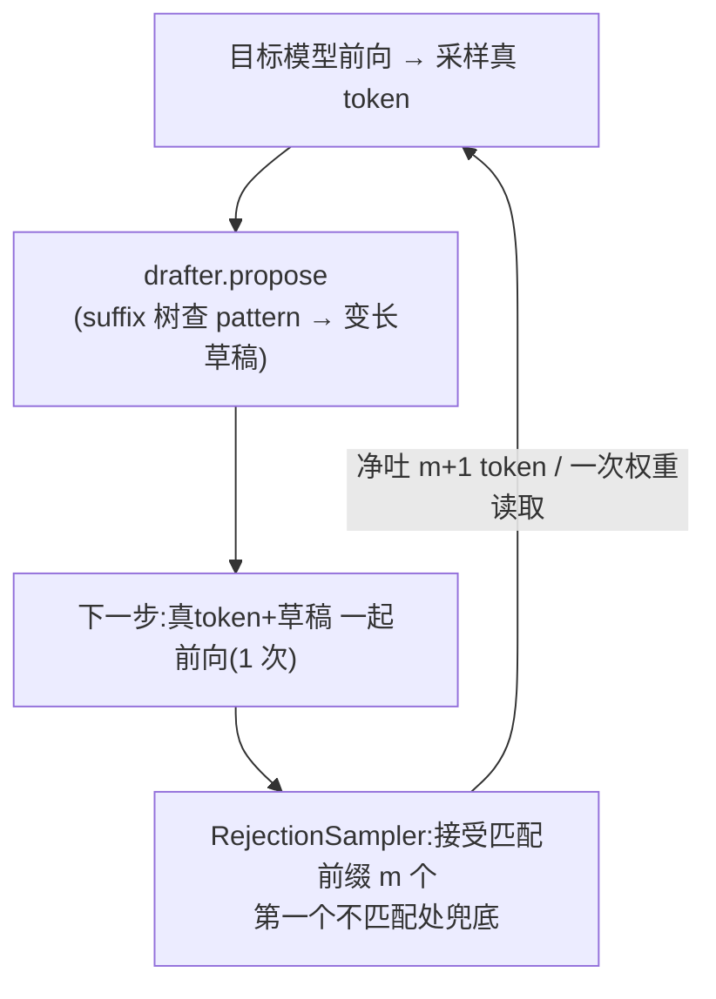

# vLLM suffix 投机解码:步骤 + 调用链(大白话)

> 缘起:deep_researcher_demo 的 RESEARCH_SUMMARY / FINAL_REPORT 生成大量**逐字照搬输入 prompt**(Coverage@8 均值 54%)。这种"输出抄输入"的场景,**suffix 投机解码**能把被抄的整段一次性猜出+验证通过,大幅提 decode 吞吐。本文讲它怎么工作、代码怎么串。
> 论文:Suffix Decoding(arXiv 2411.04975,Snowflake Arctic Inference)。vLLM 0.18 内置 `method="suffix"`,底层调 `arctic_inference` 的 C++ 后缀树(`_C`:SuffixTree/Draft)。

---

## TL;DR(一句话)
**投机解码 = "先猜一串、再一次性验证"**。普通 decode 一步只出 1 个 token(要把整个模型权重从 HBM 读一遍);投机解码一步**猜 k 个候选** token,目标模型**一次前向**把这 k 个一起验证,**匹配的前缀全部接受** → 一步吐多个 token,而权重只读一遍 → decode 吞吐涨。
**suffix 的"猜"不靠 draft 模型,而是靠"后缀树":把 prompt(和历史输出)建成树,当当前输出的结尾**与树里某段匹配**时,就把那段的后续 token 当草稿。所以"抄输入/抄历史"的地方猜得又长又准 → 提速最猛。**无损**:验证由目标模型做,接受的 token 和不开投机时逐 token 一致。

---

## 一、为什么这个场景特别适合
summary/report 在"引用原文/复述来源"时,输出就是把 prompt 里的句子**一字不差搬过来**。suffix 树是拿 prompt 建的 → 当模型开始抄某句,当前结尾 pattern 在树里精确命中那句 → **一口气把整句后续都当草稿提出来**,目标模型一次前向全验证通过。照搬越多、命中越长 → 每步接受的 token 越多 → 越快。

## 二、核心数据结构:后缀树(suffix tree)
`arctic_inference` 的 C++ 后缀树(`SuffixTree`),vLLM 侧包在 `SuffixDecodingCache` 里,管三样:
- **per-prompt 树**:每个请求的 prompt token 建一棵树,索引 prompt 所有后缀 → "给一个 pattern,查它后面常跟什么"。
- **global 树**:跨请求缓存**历史输出**(`suffix_decoding_max_cached_requests=10000`,FIFO 淘汰;设 0 则关掉、只用 prompt 树)。所以别的请求生成过的常见续写也能被猜到。
- **active 响应**:当前请求已生成的 token,边生成边加进树(这样"抄自己前文"也能命中)。

## 三、每个 decode 步做什么(`SuffixDecodingProposer.propose`)
代码:`vllm/v1/spec_decode/suffix_decoding.py` 的 `propose()`。对 batch 里每个请求:
1. **新请求**:`start_request(req_id, prompt_token_ids)` → 用 prompt 建 per-prompt 后缀树(propose 第 63-70 行)。
2. **喂新 token**:`add_active_response(req_id, sampled_ids)` → 把刚采样出的真 token 追加进该请求(树随输出增长)(第 73 行)。
3. **取结尾 pattern**:序列末尾最多 `max_tree_depth(24)` 个 token 作为 pattern(第 77-78 行)。
4. **查树出草稿**:`suffix_cache.speculate(req_id, pattern, max_spec_tokens, max_spec_factor, min_token_prob)`(第 79-87 行):
   - pattern 在 prompt 树 / global 树里匹配 → 返回"匹配段之后最可能的一串 token"当草稿。
   - **草稿长度是动态的**:`max_spec_tokens = max_spec_factor(1.0) × 前缀匹配长度`(匹配越长、猜越多),再被 `num_speculative_tokens` / 剩余长度截断。
   - 只留估计概率(按频次)≥ `min_token_prob(0.1)` 的 token。
5. 返回每个请求的 `draft.token_ids`(**各请求长度不同**,没命中就空 `[]`,退化成普通 1 token)。

> 关键:suffix 的"猜"是**查表**(后缀树遍历),不跑任何神经网络 → 提草稿几乎零成本(vs draft 模型要跑个小模型)。

## 四、草稿怎么被"验证接受"(整体调用链)
suffix 只负责**出草稿**;验证/接受由 vLLM 的通用投机解码路径做:
```
GPUModelRunner 一个 step:
  ① 目标模型前向 → 采样出本步真 token(sampled_token_ids)
  ② self.drafter.propose(...)         ← method=suffix 时 drafter=SuffixDecodingProposer
       → 每个请求得到 draft_token_ids(查后缀树,变长)
  ③ 下一 step:把 [真token + draft们] 一起喂目标模型**一次前向**(并行验证)
  ④ RejectionSampler 接受:贪心下,接受"草稿与目标模型 argmax 一致"的最长前缀;
       第一个不一致处丢弃 + 用目标模型自己的 token 兜底
  ⑤ 接受了 m 个 → 这一步净吐 m+1 个 token,而模型权重只从 HBM 读了一遍
```
装配:`vllm/v1/worker/gpu_model_runner.py:544` `self.drafter = SuffixDecodingProposer(...)`(当 `method=="suffix"`);验证器 `RejectionSampler`(同文件 import)。



## 五、为什么快(接回投机解码本质)
- decode 的瓶颈是**每步把权重从 HBM 读一遍**(memory-bound,见 [17-vllm-decode-batching-internals.md](17-vllm-decode-batching-internals.md))。
- 投机解码让**一次权重读取验证 k 个候选** → 若接受 m 个,等于"一次读权重吐 m+1 个 token" → 吞吐 ×(m+1)(上限受验证算力)。
- suffix 在"抄输入/抄历史"处 m 很大(整段命中)→ 这些段几乎免费吐出。**没抄的地方** m≈0,退化成普通 decode(不亏)。

## 六、关键参数(SpeculativeConfig,`method=suffix`)
| 参数 | 默认 | 作用 |
|---|---|---|
| `num_speculative_tokens` | 可选(suffix 自定)| 每步草稿上限;不设则由 suffix 动态决定 |
| `suffix_decoding_max_tree_depth` | 24 | pattern/树深度上限(前缀匹配+猜测和) |
| `suffix_decoding_max_spec_factor` | 1.0 | 草稿长度 = factor × 前缀匹配长度 |
| `suffix_decoding_min_token_prob` | 0.1 | 只猜频次估计概率 ≥ 此值的 token |
| `suffix_decoding_max_cached_requests` | 10000 | global 树缓存多少历史请求;0=只用 prompt 树 |

启用:`vllm serve --speculative-config '{"method":"suffix"}'`(需 `pip install arctic_inference`;若 env 是 Python 3.12 而包只带 3.11 的 `_C.so`,要从 `arctic_inference/csrc/suffix_decoding` 用 nanobind+cmake 重编)。

## 七、无损性 & 适用边界
- **无损**:接受与否由目标模型 argmax(贪心)/rejection sampling(采样)裁定 → 输出与不开投机**逐 token 一致**。
- **适合**:输出高度重复输入/历史(summary、复述、RAG 引用、代码补全、agent 抄 context)。
- **不适合**:纯创造性、与输入无重叠的输出(命中少,m≈0,几乎无增益,还多一点提草稿开销)。

## 相关
- 投机解码/decode 为何 memory-bound:[17-vllm-decode-batching-internals.md](17-vllm-decode-batching-internals.md)
- 本实验(开/关 suffix 的 decode tokens/s 对比):deep_researcher_demo `eval/run/spec_decode_replay.py` + `~/modify-code-runs/suffix-spec-decode/`
